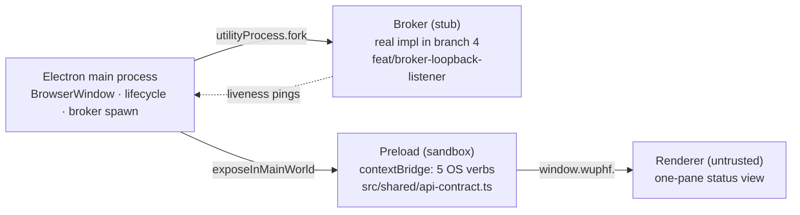

# @wuphf/desktop

WUPHF v1 desktop shell. Electron 33+ minimal application boundary: main process + sandboxed preload + minimal renderer + utility-process broker spawn.

This package is the **OS-level security boundary** for the rewrite. Everything app-related (receipts, projections, broker state, OAuth tokens) lives behind a separate process the renderer reaches over loopback HTTP. The shell only exposes OS verbs (open external URL, show file in folder, app version, broker liveness).

## Run it

```bash
bun install                    # at repo root, once
bun run desktop:dev            # boots Electron window
```

The window shows a single status pane:

```
WUPHF v1 desktop shell
Broker: alive ✓
Platform: darwin / arm64
[ Open repo on GitHub ]   ← click to test allowlisted IPC
```

Quit with `Cmd+Q` / `Ctrl+Q`. Broker shutdown is cooperative: the supervisor
sends a parentPort shutdown message, waits a 5s grace window, uses
`UtilityProcess.kill()` for handle-bound cleanup on POSIX, and uses
`taskkill /pid <pid> /T` with `/F` escalation on Windows.

## Build it

```bash
cd apps/desktop && bun run build
# Outputs to apps/desktop/out/{main,preload,renderer}
```

The packaged installer (.dmg / .exe / .AppImage) is produced by `feat/installer-pipeline`, not this package.

## Test it

```bash
cd apps/desktop && bun run test                # vitest
cd apps/desktop && bun run test:coverage       # one-way ratchet
cd apps/desktop && bun run check:ipc-allowlist # CI grep gate
```

## Architecture



The renderer **never** touches `~/.wuphf/` or any file under it. Anything app-data-shaped travels over loopback HTTP/SSE in a future branch.

## Read more

- [`AGENTS.md`](./AGENTS.md) — 16 hard rules every contributor (human or AI) must follow.
- [`docs/modules/preload.md`](./docs/modules/preload.md) — the contextBridge allowlist contract.
- [`docs/modules/broker-spawn.md`](./docs/modules/broker-spawn.md) — utility-process lifecycle, restart policy.
- [`docs/modules/security-model.md`](./docs/modules/security-model.md) — threat model, sandbox guarantees, what each layer trusts.

## RFC anchors

Architecture: §7.1, §7.3. Branch: §15 row 2 (`feat/desktop-shell-skeleton`, week 0–2). Future renderer wiring: §15 row 4.
