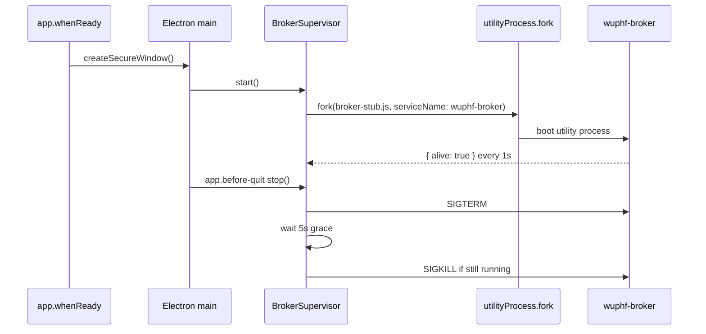

# Broker Spawn

The desktop shell supervises a broker utility process. The current broker entry
is `src/main/broker-stub.ts`, which sends liveness pings until the loopback
listener branch replaces it.



## Crash-Restart Policy

Unexpected broker exits are restarted with exponential backoff:

```text
backoffMs = min(60_000, 250 * 2 ** restartCount)
```

`restartCount` increments before each scheduled retry. After five retries the
supervisor enters a fatal state, reports the failure to the main process, and
does not restart again. Status reported through IPC remains lifecycle-only:
`starting`, `alive`, `dead`, or `unknown`.

The restart scheduler records `performance.now()` as monotonic timing metadata.
This is the single AGENTS.md rule-11 exception for `src/main/`; wall-clock Date
APIs remain banned.

## Env Allowlist

The broker does not inherit the full parent environment. Only these variables
are passed through:

| Variable | Why |
|---|---|
| `PATH` | Allows the utility process to resolve normal local tooling when needed. |
| `HOME` | Keeps OS-level path resolution consistent without exposing app data. |
| `USER` | Standard OS identity metadata for local process behavior. |
| `LANG` | Locale for deterministic text behavior. |
| `LC_ALL` | Locale override when explicitly set by the user environment. |
| `TZ` | Time zone context for future user-facing local formatting. |

Secrets, tokens, cloud credentials, and app-data paths are not passed through.
