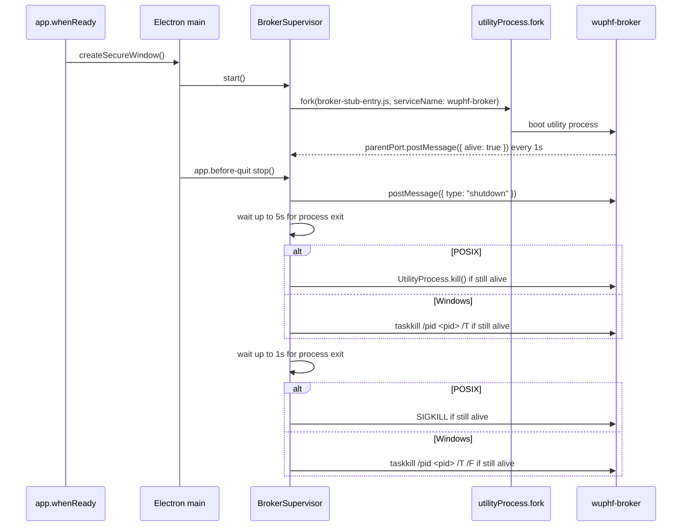

# Broker Spawn

The desktop shell supervises a broker utility process. The current broker entry
is `src/main/broker-stub-entry.ts`, which uses Electron's `process.parentPort`
utility-process wire to send liveness pings until the loopback listener branch
replaces it.



## Crash-Restart Policy

Unexpected broker exits are restarted with exponential backoff:

```text
backoffMs = min(60_000, firstBackoffMs * 2 ** (restartCount - 1))
```

`restartCount` increments before each scheduled retry, so the first wait is
250ms, then 500ms, 1000ms, and so on. After five consecutive retries the
supervisor enters a fatal state, reports the failure to the main process, and
does not restart again. If a restarted broker remains alive past the 60s
stability window, the retry counter resets to zero. Status reported through IPC
remains lifecycle-only: `starting`, `alive`, `unresponsive`, `dead`, or
`unknown`; `unresponsive` means the process has not sent a liveness ping within
5s.

The supervisor reads monotonic time through `src/main/monotonic-clock.ts` for
restart metadata, the stability window, and liveness staleness. Wall-clock Date
APIs remain banned.

Broker lifecycle evidence is written to the main-process local JSONL log under
Electron's standard logs directory. Unexpected exits emit `broker_exited` with
`pid`, `exitCode`, `signal`, `restartCount`, `uptimeMs`, and `lastPingAt`.
Electron's `UtilityProcess` exit event exposes an exit code but not a signal on
the supported typed surface, so `signal` is `null` unless Electron adds that
field in a future supported release.

## Env Allowlist

The broker does not inherit the full parent environment. Only these variables
are passed through:

| Variable | Why |
|---|---|
| `PATH` | Allows the utility process to resolve normal local tooling when needed. |
| `HOME` | Keeps OS-level path resolution consistent without exposing app data. |
| `USER` | Standard OS identity metadata for local process behavior. |
| `LANG` | Locale for deterministic text behavior. |
| `LC_ALL` | Locale override when explicitly set by the user environment. |
| `TZ` | Time zone context for future user-facing local formatting. |

Secrets, tokens, cloud credentials, and app-data paths are not passed through.
