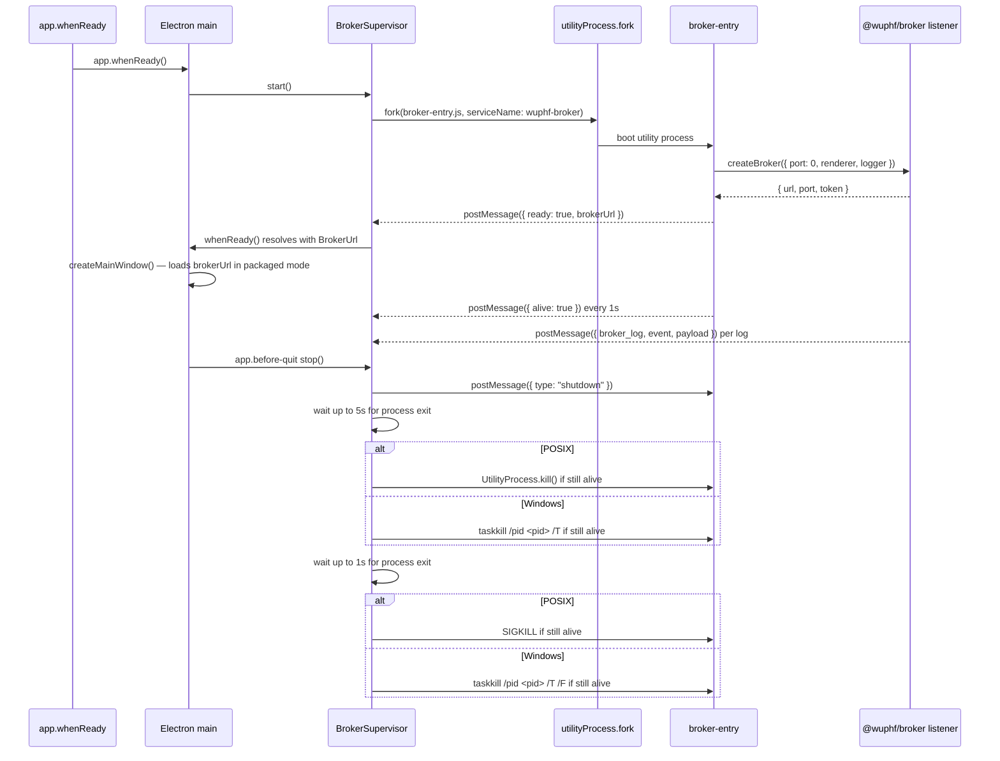

# Broker Spawn

The desktop shell supervises a broker utility process. The broker entry is
`src/main/broker-entry.ts`, which boots `@wuphf/broker`'s loopback HTTP/SSE/
WebSocket listener and reports the bound URL back to the supervisor through
Electron's `process.parentPort` channel.



## Ready Handshake

The supervisor exposes `whenReady(): Promise<BrokerUrl>` which resolves once
the broker subprocess posts `{ ready: true, brokerUrl }`. The URL is
validated against `@wuphf/protocol`'s `isBrokerUrl` brand at the IPC
boundary — a malformed message is dropped, not handed downstream as a
"string" the renderer might trust as a fetch origin.

In packaged mode the `BrowserWindow` loads `${brokerUrl}/` so `/api-token`,
`/api/*`, and the agent terminal WebSocket are all same-origin loopback. In
dev mode (electron-vite serves the renderer) the broker still starts and
the renderer reaches it cross-origin via `getBrokerStatus().brokerUrl`.

`subscribeReady(listener)` fires on every `{ ready }`, including restarts.
The main process uses this to destroy and recreate the `BrowserWindow` when
the broker rebinds to a new ephemeral port — the renderer's
`window.location.origin` would otherwise point at a dead listener after a
restart.

## Startup Watchdog

If the subprocess fails to post `{ ready }` within `startupTimeoutMs`
(default 10 s), the supervisor kills the wedged process. `handleExit`
schedules the existing restart cycle, which counts against the cap; a
permanently-wedged broker eventually surfaces a `fatalReason` and rejects
all pending `whenReady()` waiters.

## Crash-Restart Policy

Unexpected broker exits are restarted with exponential backoff:

```text
backoffMs = min(60_000, firstBackoffMs * 2 ** (restartCount - 1))
```

`restartCount` increments before each scheduled retry, so the first wait is
250ms, then 500ms, 1000ms, and so on. After five consecutive retries the
supervisor enters a fatal state, reports the failure to the main process, and
does not restart again. If a restarted broker remains alive past the 60s
stability window, the retry counter resets to zero. Status reported through IPC
remains lifecycle-only: `starting`, `alive`, `unresponsive`, `dead`, or
`unknown`; `unresponsive` means the process has not sent a liveness ping within
5s.

The supervisor reads monotonic time through `src/main/monotonic-clock.ts` for
restart metadata, the stability window, and liveness staleness. Wall-clock Date
APIs remain banned.

Broker lifecycle evidence is written to the main-process local JSONL log under
Electron's standard logs directory. Unexpected exits emit `broker_exited` with
`pid`, `exitCode`, `signal`, `restartCount`, `uptimeMs`, and `lastPingAt`.
Electron's `UtilityProcess` exit event exposes an exit code but not a signal on
the supported typed surface, so `signal` is `null` unless Electron adds that
field in a future supported release.

Broker subprocess logs (from the `@wuphf/broker` listener — `listener_started`,
`listener_loopback_denied`, `ws_upgrade_rejected`, etc.) arrive as
`{ broker_log, event, payload }` messages and are forwarded through the
main-process structured logger as `broker_<event>` entries. Payload keys are
filtered against the desktop logger's allowlist (banned fragments: `url`,
`path`, `token`, `secret`, `password`); unsafe keys are dropped and accounted
for via `droppedKeys: <count>`.

## Env Allowlist

The broker does not inherit the full parent environment. Only these variables
are passed through:

| Variable | Why |
|---|---|
| `PATH` | Allows the utility process to resolve normal local tooling when needed. |
| `HOME` | Keeps OS-level path resolution consistent without exposing app data. |
| `USER` | Standard OS identity metadata for local process behavior. |
| `LANG` | Locale for deterministic text behavior. |
| `LC_ALL` | Locale override when explicitly set by the user environment. |
| `TZ` | Time zone context for future user-facing local formatting. |
| `WUPHF_RENDERER_DIST` | Packaged-only renderer bundle path so the broker can serve `/`. |
| `WUPHF_DEV_RENDERER_ORIGIN` | Dev-only electron-vite renderer origin accepted by the broker's `/api-token` gate. |
| `WUPHF_RECEIPT_STORE_PATH` | Absolute path to the durable receipt-store SQLite database. Set by main to `<userData>/event-log.sqlite`; absent → broker uses an in-memory store. |

Secrets, tokens, and cloud credentials are not passed through. The
`WUPHF_RECEIPT_STORE_PATH` is the one app-data path that crosses the
boundary — it lets the utility process open the durable
`SqliteReceiptStore`.

### Receipt-store recovery

If the durable store fails the broker route surface returns:

- `507 store_full` — disk full or the in-memory cap exceeded.
- `503 store_busy` with `Retry-After: 1` — transient `SQLITE_BUSY`/`LOCKED`;
  retry typically succeeds.
- `503 storage_error` — persistent `SQLITE_READONLY`/`SQLITE_IOERR_*`/
  `SQLITE_CORRUPT`. Operator intervention needed.

For recovery, stop the broker, move the file at `WUPHF_RECEIPT_STORE_PATH`
aside (and its `-wal`/`-shm` sidecars), then restart the app — the broker
will create a fresh database. Receipts in the moved file can be salvaged
offline by reading the canonical JSON payloads in the
`receipts_projection.payload` column.
