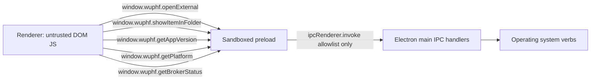

# Preload ContextBridge Contract

The preload script is the only renderer-visible IPC surface. It exposes one
global, `window.wuphf`, with the five OS verbs defined in
`src/shared/api-contract.ts`.

## Verbs

| Verb | Channel | Payload | Response | Rationale |
|---|---|---|---|---|
| `openExternal` | `wuphf:open-external` | `{ url: string }` | `{ ok: true }` or `{ ok: false, error: string }` | Hands a URL to the OS default browser. No app data crosses the boundary. |
| `showItemInFolder` | `wuphf:show-item-in-folder` | `{ path: string }` | `{ ok: true }` or `{ ok: false, error: string }` | Reveals a path in the OS file manager. Path is supplied by the renderer; main does not return file contents. |
| `getAppVersion` | `wuphf:get-app-version` | `{}` | `{ version: string }` | Returns Electron `app.getVersion()`; the binary's own version string is not user data. |
| `getPlatform` | `wuphf:get-platform` | `{}` | `{ platform: DesktopPlatform, arch: string }` | Returns `process.platform` and `process.arch`. Static OS facts, not user data. |
| `getBrokerStatus` | `wuphf:get-broker-status` | `{}` | `{ status, pid, restartCount }` where status is `starting`, `alive`, `unresponsive`, `dead`, or `unknown` | Returns only broker utility-process lifecycle state. It does not expose broker data. |

Every main-process handler validates the payload shape at the IPC boundary.
Unknown keys are rejected so the contract cannot silently drift.

## Adding A Verb

The allowlist is closed. Adding a verb requires all four steps in one change:

1. Add a new `IpcChannel.*` entry and typed request/response in
   `src/shared/api-contract.ts`.
2. Add a handler in `src/main/ipc/<verb>.ts` that validates the payload at the
   boundary.
3. Add a test in `tests/preload-allowlist.spec.ts` proving the verb is exposed
   and wired through `ipcRenderer.invoke`.
4. Add one `IPC_ALLOWLIST_RATIONALE` line explaining why the verb is an OS verb,
   not app data, and update this document.
