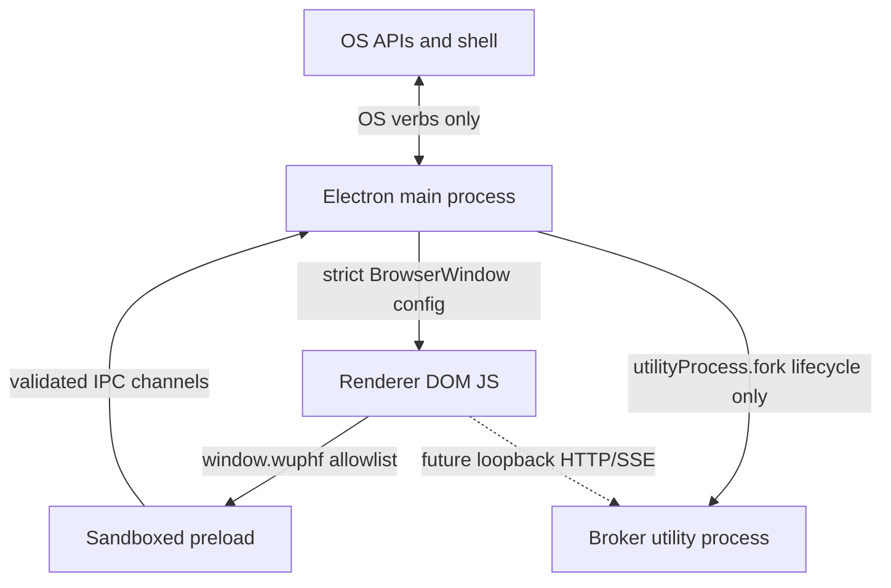

# Security Model

RFC anchors: §7.1 process topology and §7.3 IPC discipline.

## Trust Boundaries

| Layer | Trusts | Does Not Trust |
|---|---|---|
| OS | Main process requests for allowlisted verbs. | Renderer-provided URLs or paths until the main handler validates them. |
| Main | Electron APIs, local package code, and the broker process lifecycle handle. | Renderer IPC payloads, window navigation targets, `window.open` targets, inherited environment variables. |
| Preload | The shared TypeScript contract and Electron `contextBridge`. | Renderer code. It never exposes `ipcRenderer` directly. |
| Renderer | The typed `window.wuphf` surface. | Node APIs, Electron internals, broker secrets, app data. |
| Broker | Its own utility process runtime. | Renderer IPC and main-process app-data proxying. This shell only supervises lifecycle. |

## Threat Model

Injected JS in the renderer is contained by `sandbox: true`, `contextIsolation:
true`, `nodeIntegration: false`, strict CSP, and the closed `window.wuphf`
allowlist. It can request OS verbs, but every payload is validated in main.

Malicious `window.open` calls are denied. The main process may hand off
`https:`, `http:`, or `mailto:` URLs to the OS default handler, but the new
Electron window is never created.

Fake IPC payloads are treated as untrusted input. Handlers reject unknown keys,
wrong types, unsafe URL schemes, and relative paths before touching Electron OS
APIs.

Broker compromise is scoped away from renderer IPC. The shell only starts,
stops, and reports lifecycle status for the utility process. App data and
secrets do not cross the contextBridge; the renderer-to-broker data path lands
over loopback HTTP/SSE in the future broker listener branch.

Remote navigation is blocked. Development loads only
`http://localhost:<vite-port>` or `http://127.0.0.1:<vite-port>`, and production
loads only the bundled `file://` renderer document.

## CSP Loopback Exception

The renderer CSP currently allows `connect-src` to `http://127.0.0.1:*` and
`http://localhost:*` because the broker loopback listener branch owns the final
port binding. This wildcard is a known temporary limitation: once
`feat/broker-loopback-listener` defines the broker port, production CSP must
allow only that concrete loopback endpoint.
