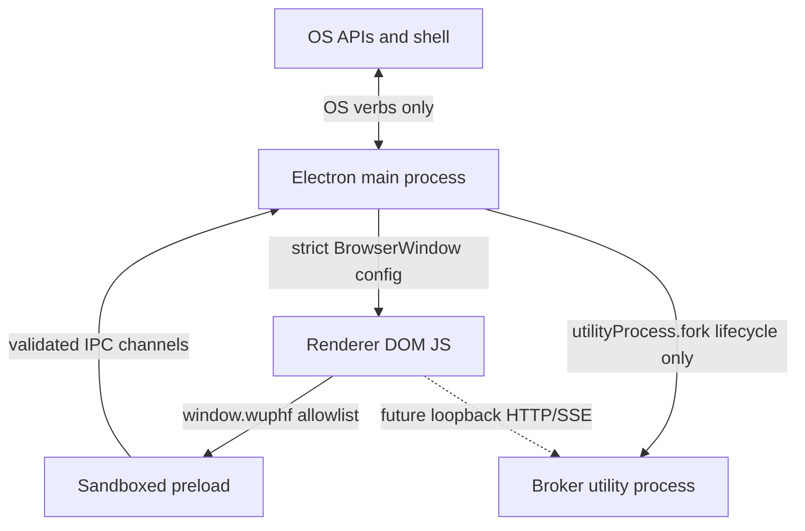

# Security Model

RFC anchors: §7.1 process topology and §7.3 IPC discipline.

## Trust Boundaries

| Layer | Trusts | Does Not Trust |
|---|---|---|
| OS | Main process requests for allowlisted verbs. | Renderer-provided URLs or paths until the main handler validates them. |
| Main | Electron APIs, local package code, and the broker process lifecycle handle. | Renderer IPC payloads, window navigation targets, `window.open` targets, inherited environment variables. |
| Preload | The shared TypeScript contract and Electron `contextBridge`. | Renderer code. It never exposes `ipcRenderer` directly. |
| Renderer | The typed `window.wuphf` surface. | Node APIs, Electron internals, broker secrets, app data, localhost services until the broker loopback listener owns a concrete port. |
| Broker | Its own utility process runtime. | Renderer IPC and main-process app-data proxying. This shell only supervises lifecycle. |

## Threat Model

Injected JS in the renderer is contained by `sandbox: true`, `contextIsolation:
true`, `nodeIntegration: false`, strict CSP, and the closed `window.wuphf`
allowlist. It can request OS verbs, but every payload is validated in main.

Malicious `window.open` calls are denied. The main process may hand off
`https:`, `http:`, or `mailto:` URLs to the OS default handler, but the new
Electron window is never created.

## openExternal As Exfiltration Channel

`openExternal` intentionally opens arbitrary user-clicked `https:`, `http:`,
and `mailto:` URLs in the OS default handler. That means a renderer compromise
can still ask the main process to open a remote URL with attacker-controlled
query parameters; this bypasses renderer CSP because the request is made by the
external browser, not by the sandboxed renderer.

The handler keeps the broad URL contract but limits damage with scheme
validation and a main-process rate limit of five successful handoffs per
10-second window. This does not remove the channel, but it prevents a malicious
renderer from streaming data through thousands of browser launches per second.

Fake IPC payloads are treated as untrusted input. Handlers reject unknown keys,
wrong types, unsafe URL schemes, and relative paths before touching Electron OS
APIs.

Broker compromise is scoped away from renderer IPC. The shell only starts,
stops, and reports lifecycle status for the utility process. App data and
secrets do not cross the contextBridge; the renderer-to-broker data path lands
over loopback HTTP/SSE in the future broker listener branch.

Remote navigation is blocked. Development loads only
`http://localhost:<vite-port>` or `http://127.0.0.1:<vite-port>`, and production
loads only the bundled `file://` renderer document.

## CSP Loopback Placeholder

The renderer CSP currently sets `connect-src` to only `'self'` and
`http://127.0.0.1:0`. Port 0 is reserved, so this placeholder does not grant
connectivity to local HTTP services such as CUPS, Jupyter, Redis, databases, or
development servers. Until `feat/broker-loopback-listener` binds the actual
broker port, renderer JS has no localhost network egress by policy. That branch
must replace the placeholder with the one concrete broker origin.
