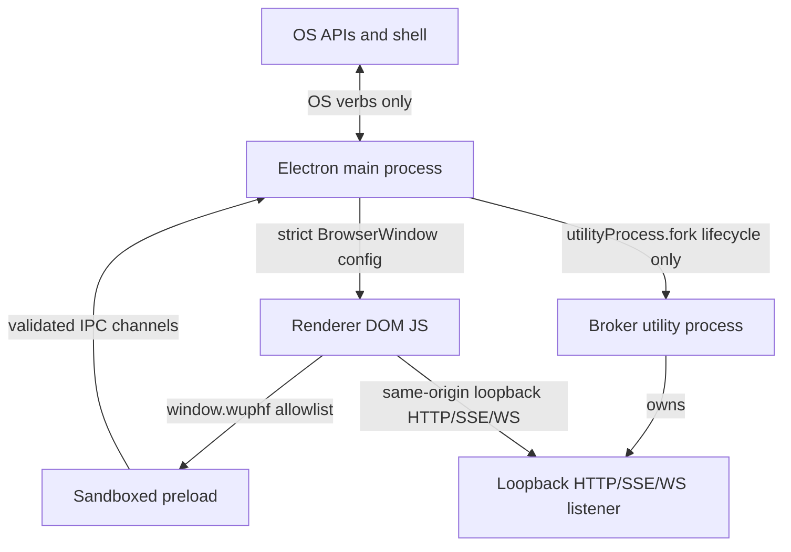

# Security Model

RFC anchors: §7.1 process topology and §7.3 IPC discipline.

## Trust Boundaries

| Layer | Trusts | Does Not Trust |
|---|---|---|
| OS | Main process requests for allowlisted verbs. | Renderer-provided URLs or paths until the main handler validates them. |
| Main | Electron APIs, local package code, and the broker process lifecycle handle. | Renderer IPC payloads, window navigation targets, `window.open` targets, inherited environment variables. |
| Preload | The shared TypeScript contract and Electron `contextBridge`. | Renderer code. It never exposes `ipcRenderer` directly. |
| Renderer | The typed `window.wuphf` surface. | Node APIs, Electron internals, broker secrets, app data, localhost services until the broker loopback listener owns a concrete port. |
| Broker | Its own utility process runtime. | Renderer IPC and main-process app-data proxying. This shell only supervises lifecycle. |

## Threat Model

Injected JS in the renderer is contained by `sandbox: true`, `contextIsolation:
true`, `nodeIntegration: false`, strict CSP, and the closed `window.wuphf`
allowlist. It can request OS verbs, but every payload is validated in main.

Malicious `window.open` calls are denied. The main process may hand off
`https:`, `http:`, or `mailto:` URLs to the OS default handler, but the new
Electron window is never created.

## openExternal As Exfiltration Channel

`openExternal` intentionally opens arbitrary user-clicked `https:`, `http:`,
and `mailto:` URLs in the OS default handler. That means a renderer compromise
can still ask the main process to open a remote URL with attacker-controlled
query parameters; this bypasses renderer CSP because the request is made by the
external browser, not by the sandboxed renderer.

The handler keeps the broad URL contract but limits damage with scheme
validation and a main-process rate limit of five successful handoffs per
10-second window. This does not remove the channel, but it prevents a malicious
renderer from streaming data through thousands of browser launches per second.

Fake IPC payloads are treated as untrusted input. Handlers reject unknown keys,
wrong types, unsafe URL schemes, and relative paths before touching Electron OS
APIs.

Broker compromise is scoped away from renderer IPC. The shell only starts,
stops, and reports lifecycle status for the utility process. App data and
secrets do not cross the contextBridge; the renderer reaches the broker over
loopback HTTP/SSE.

Remote navigation is blocked. Development loads only the exact
`ELECTRON_RENDERER_URL` value set by electron-vite for the Vite renderer, and
production loads only the bundled `file://` renderer document.

## CSP

The renderer bundle has a strict fallback CSP in `src/renderer/index.html` and
an authoritative header injected by the main process in `src/main/csp.ts`:

- `default-src 'self'` and `script-src 'self'` — no inline scripts, no remote.
- `style-src 'self'` — no inline styles. Vite extracts CSS to external
  `<link>` stylesheets at build; dev mode loads through electron-vite and
  does not see this CSP, so HMR is unaffected.
- `connect-src 'self'` in the meta tag — safe fallback before broker readiness.
- `connect-src 'self' <broker-origin>` in the injected header when the broker
  has published its loopback URL. The header is re-derived for every response,
  so a broker restart on a new ephemeral port immediately changes the allowed
  origin without rewriting HTML on disk.
- `frame-ancestors 'none'` and `object-src 'none'` — no embedding, no plugins.
- `base-uri 'self'` — block `<base href>` redirection of relative URLs.

The renderer's `<meta http-equiv="Content-Security-Policy">` tag remains a
strict fallback. The Electron `webRequest.onHeadersReceived` header is
authoritative for dev and packaged HTTP responses.

## Loopback Trust Model

The broker's loopback listener binds `127.0.0.1` and accepts
`Host: 127.0.0.1:<port>` or `Host: localhost:<port>` as the loopback trust
boundary. That means:

- **Trusted**: any process running on the same machine as the user can reach
  the listener. The DNS-rebinding guard combines the broker's exact Host
  allowlist with `@wuphf/protocol`'s `isLoopbackRemoteAddress` peer-IP check
  to keep remote peers out, but does not distinguish "the desktop renderer"
  from "a curl shell on the box" or "a Chrome extension with localhost access".
- **Implication**: `/api-token` issues the bearer to any same-machine caller
  that gets past the loopback + Origin gates. The bearer then grants the
  full bearer-protected API surface (`/api/*`) and the agent terminal
  WebSocket.

This is the documented v1 trust model. Mitigations on the browser side
(`/api-token` route in `packages/broker/src/listener.ts`):

- **Origin gate**: when `Origin` is present, it must match the broker URL
  synthesized for the validated Host header (`http://127.0.0.1:<port>` or
  `http://localhost:<port>`). Cross-origin browser fetches —
  including from Chrome extensions, dev-tool consoles attached to other
  pages, and same-machine web apps on a different port — are rejected with
  `403 cross_origin_api_token`.
- **Sec-Fetch-Site gate**: when present, must be `same-origin` or `none`
  (user-initiated, e.g. typed in address bar). `cross-site`/`same-site` are
  rejected.

Both gates are defense-in-depth for the **browser context**. Non-browser
callers on the same machine (curl, Python script, malware running as the
user) bypass these gates by omitting the headers. The loopback trust
boundary is the load-bearing assumption; if a future branch wants stricter
isolation, the path is an Electron IPC-bound bootstrap or one-time
renderer-bound nonce that never touches HTTP.
