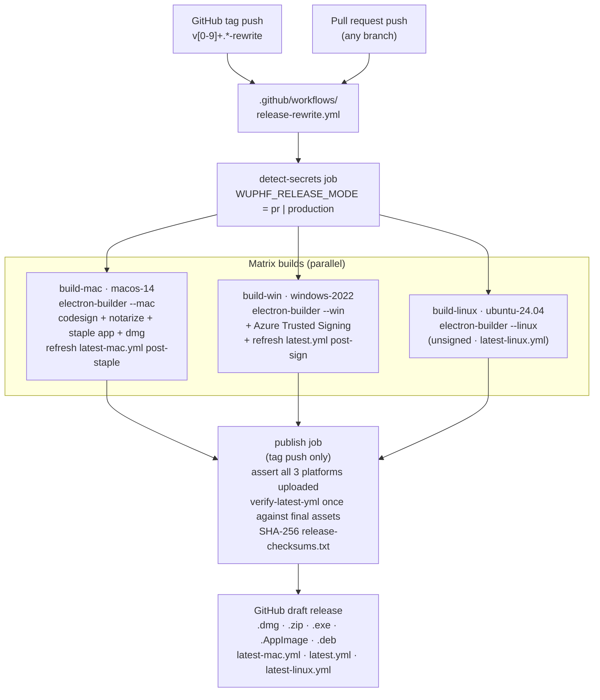

# @wuphf/installer-stub

WUPHF v1 installer pipeline. Tiny Electron hello-world packaged by electron-builder, signed (Apple Dev ID + Azure Trusted Signing), notarized (Mac), and shipped with electron-updater manifests for macOS, Windows, and Linux.

This stub exists *only* so we can prove the signing + auto-update story end-to-end **today**, before the real desktop shell ([`feat/desktop-shell-skeleton`](https://github.com/nex-crm/wuphf/pulls?q=is%3Apr+head%3Afeat%2Fdesktop-shell-skeleton)) lands. When that branch merges and stabilizes, the `electron-builder.yml` `files:` glob retargets to `apps/desktop/` and this stub gets deleted in the same PR.

## Run it

```bash
# From repo root:
bun run installer:build:local

# From apps/installer-stub/:
bun run build:dry-run
bun run build:current
```

Local builds do not sign or upload unless the signing env vars are present.

```text
# build:dry-run
# → dist/wuphf-installer-stub-0.0.0-mac-universal.zip  (mac)
# → dist/latest-mac.yml  (mac)
#
# build:current
# → dist/wuphf-installer-stub-0.0.0-mac-universal.dmg  (mac)
# → dist/wuphf-installer-stub-0.0.0-win-x64.exe  (win)
# → dist/wuphf-installer-stub-0.0.0-linux-x64.AppImage  (linux)
```

Install the artifact, double-click it, see one window:

```
WUPHF installer-stub v0.0.0
Channel: dev
Auto-update: idle
[ Check for updates ]
```

## Test the release pipeline

```bash
# Local equivalents for PR checks (no secrets needed)
cd apps/installer-stub && WUPHF_RELEASE_MODE=pr bun run check:secrets
cd apps/installer-stub && WUPHF_RELEASE_MODE=pr bun run build:current

# In CI, on a tag push (matrix: macos-14 / windows-2022 / ubuntu-24.04)
# Triggered by tags matching `v[0-9]*-rewrite`
# See: .github/workflows/release-rewrite.yml
```

## Secrets you'll need (production releases only)

| Secret | Used for | Setup |
|---|---|---|
| `APPLE_ID` | Apple notarytool auth | [docs/runbooks/apple-dev-id-setup.md](./docs/runbooks/apple-dev-id-setup.md) |
| `APPLE_TEAM_ID` | Apple notarytool team | same |
| `APPLE_APP_SPECIFIC_PASSWORD` | Apple notarytool password | same |
| `APPLE_CERT_P12_BASE64` | Developer ID cert (base64-encoded .p12) | same |
| `APPLE_CERT_PASSWORD` | .p12 unlock password | same |
| `AZURE_TENANT_ID` | Azure Trusted Signing tenant | [docs/runbooks/azure-trusted-signing-setup.md](./docs/runbooks/azure-trusted-signing-setup.md) |
| `AZURE_CLIENT_ID` | Azure Trusted Signing app | same |
| `AZURE_CLIENT_SECRET` | Azure Trusted Signing secret | same |
| `AZURE_SIGNING_ACCOUNT_NAME` | Trusted Signing account name | same |
| `AZURE_CERT_PROFILE_NAME` | Cert profile (e.g. `wuphf-prod-2026`) | same |
| `AZURE_ENDPOINT` | Trusted Signing endpoint | same |

When all are set, tag pushes produce signed + notarized + auto-updateable artifacts. When some are missing, PR pushes still produce unsigned-with-warning artifacts (CI green, useful for local testing).

macOS signing imports `APPLE_CERT_P12_BASE64` into a temporary CI keychain before electron-builder signs and notarizes the app. Windows signing builds first, signs the final installer output with the pinned `Azure/trusted-signing-action`, then refreshes `latest.yml` so electron-updater hashes match the signed artifact.

## Architecture



## Read more

- [`AGENTS.md`](./AGENTS.md) — 13 hard rules (signing, secrets, reproducibility).
- [`docs/runbooks/apple-dev-id-setup.md`](./docs/runbooks/apple-dev-id-setup.md) — provisioning Apple Dev ID + notarytool.
- [`docs/runbooks/azure-trusted-signing-setup.md`](./docs/runbooks/azure-trusted-signing-setup.md) — provisioning Azure Trusted Signing.
- [`docs/runbooks/github-environment-setup.md`](./docs/runbooks/github-environment-setup.md) — scoping release secrets to `production-release`.
- [`docs/runbooks/linux-distribution.md`](./docs/runbooks/linux-distribution.md) — what we sign vs. what we don't on Linux.
- [`docs/auto-update-strategy.md`](./docs/auto-update-strategy.md) — full-download updates and blockmap policy.
- [`docs/runbooks/release-day-troubleshooting.md`](./docs/runbooks/release-day-troubleshooting.md) — release rerun guardrails.

## RFC anchors

Distribution: §11. Branch: §15 row 3 (`feat/installer-pipeline`, week 1–3). Signed artifact end-to-end: §15 row 3 last clause.
