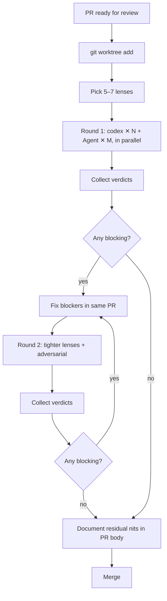

# Orthogonal PR Review

A multi-agent rhythm for reviewing a single PR through several
narrowly-scoped lenses to catch issues that one reviewer would miss.

This is a **PR-review** companion to the design-time pattern in
`INSTRUCTIONS.md` ("Triangulation through orthogonal sub-agents") and
the implementation rhythm ("Multi-round review rhythm"). The
triangulation script at `scripts/dispatch-triangulation.sh` is the
underlying mechanism; this doc adds a PR-shaped lens menu, dispatch
guidance for mixed codex + Claude fleets, and the round-2 rhythm.

## When to use

- **Always**: major dependency bumps that touch the build chain (Vite,
  electron-vite, TypeScript, vitest, electron itself, Node types).
- **Always**: changes to the contextBridge allowlist, IPC surface, or
  any rule under `apps/desktop/AGENTS.md`'s hard-rules list.
- **Usually**: schema migrations, broker process changes, anything
  affecting the release pipeline.
- **Skip**: trivial refactors, doc-only changes, copy fixes, tests-only
  PRs that don't change product code.

## Lens menu

Pick 5–7 lenses from this list. Each prompt enforces "YOUR LENS, AND
ONLY THIS LENS" so coverage doesn't overlap. Pick a default model per
lens to bias the fleet toward orthogonality (different models, not just
different prompts).

| # | Lens | Default model | What it checks |
|---|---|---|---|
| 1 | Type correctness | codex | Are type fixes the right fix, or do they mask real errors? |
| 2 | Supply chain / lockfile | codex | New transitives, peer-dep mismatches, removed deps, integrity |
| 3 | Build / runtime parity | codex | Does the build still produce equivalent output? Externalization preserved? |
| 4 | Scope discipline | claude (`staff-code-reviewer`) | Is the diff narrowly the advertised change, no drive-bys? |
| 5 | Repo conventions | codex | CLAUDE.md / AGENTS.md / INSTRUCTIONS.md compliance |
| 6 | Security / IPC | codex | Allowlist intact? No `any` across contextBridge? Sandbox preserved? |
| 7 | Test coverage equivalence | codex | Do tests still cover what they should? Versioning consistent? |
| 8 | Beta / pre-release stability | codex | If pinning a beta: how risky, what's the upgrade path? |
| 9 | Adversarial sweep | codex | "Assume earlier lenses missed something — what is it?" Always include. |

Lenses 1–8 are about *finding the things*. Lens 9 is about *finding what
the finders missed*. Round 2 is centered on lens 9.

## Dispatch

- **Default to codex** (`codex exec --skip-git-repo-check --cd <worktree>`).
  Cheap, parallelizes well, runs fully non-interactive. Use it for
  every lens unless there's a reason to prefer Claude.
- **Use Claude Agents** (`staff-code-reviewer`, `general-purpose`) when:
  - The lens benefits from instruction-following over raw analysis
    (scope discipline, conventions checks).
  - The lens needs cross-package context spanning more files than
    codex's read window comfortably handles.
  - You're rate-limited the other way (rare).
- **Always run in parallel.** `Bash` with `run_in_background: true` for
  codex; `Agent` with `run_in_background: true` for Claude. Dispatch
  every lens in a single message of tool calls.
- **Worktree, not main checkout.** Codex agents need the diff committed
  on a branch they can `git diff origin/main...HEAD` against. Use
  `git worktree add` so the user's primary workspace stays clean.

### Prompt structure

Each lens prompt follows the same shape so the fleet stays comparable:

```text
You are reviewing PR #<N> in <owner>/<repo>, branch `<branch>`. The PR
<one-sentence stated scope>.

YOUR LENS, AND ONLY THIS LENS: <single specific concern>

Investigate:
1. <numbered step with concrete file paths>
2. <numbered step with verification command>
3. ...

Output (under <N> words):
- Verdict: APPROVE / APPROVE-WITH-NITS / REQUEST-CHANGES
- Findings (numbered, with file:line refs)
- Recommended actions

Do NOT comment on <other lenses>. Stay strictly on this lens.
```

Word cap: 250–400 words per lens. Anything longer means the lens is too
broad — split it.

## Synthesis

After all lenses finish:

1. **Aggregate verdicts.** Any single REQUEST-CHANGES makes the
   aggregate REQUEST-CHANGES.
2. **Distinguish blocking from nits.**
   - **Blocking**: build/test/runtime regression; security regression;
     scope creep; broken externalization; peer-dep contract violation.
   - **Nit**: stylistic; future-proofing; non-actionable opinion; the
     fix would create more risk than the issue.
3. **Fix the blockers in the same PR.** Don't punt to follow-ups.
4. **Document the nits in the PR body.** A future reader should see
   what was caught and why it's acceptable.
5. **Verify findings before acting.** Codex sometimes claims things
   that look authoritative but are wrong (e.g., reading
   `viteVersion` from `vitest/node` and concluding vitest runs on a
   given vite version when it's actually a build-time constant). Read
   the actual files before applying the fix.

## Round 2

After applying fixes, dispatch a **smaller, sharper** second round on
the new commit:

- **Drop** lenses whose findings are now invariant (scope, conventions,
  any lens that returned APPROVE in round 1).
- **Keep** lenses that touch the changed files (build parity, lockfile
  delta if the fix re-installed deps).
- **Always include adversarial sweep**: prompt it with a list of what
  round 1 covered and tell it to find what was missed.

Round 2 catches regressions introduced by the round-1 fixes.

## Flow



## Anti-patterns

- **Single-lens "give it a once-over"** defeats the purpose.
- **Same model for every lens** defeats the orthogonality.
- **Reviewing without a worktree** — agents need the diff committed.
- **Trusting a verdict without verifying its evidence** — codex once
  claimed vitest was running vite 7 based on a misread export; once
  claimed vite 8 was working when the build had silently inlined the
  electron installer shim. Verify.
- **Stopping after round 1 finds blockers** — the fixes need their
  own review.
- **Letting nits become a review-blocking checklist** — distinguish
  blocking from non-blocking firmly.

## Worked example

**PR #785** — `chore(desktop)(deps-dev): bump electron-vite, typescript,
vite, @types/node`. Round 1 dispatched 5 codex + 1 Claude across 7
lenses. Two independent codex agents (supply-chain, build parity) caught
that vite 8 was out of contract with electron-vite 5: bun resolved both
versions simultaneously, vitest used the nested vite 7, and the main +
preload bundles inlined the npm electron installer shim instead of
externalizing electron. Round 1 fix: bump electron-vite to 6.0.0-beta.1
(the only published line declaring `vite: ^8`).

Round 2 dispatched 5 codex on tighter lenses (beta stability, bundle
parity vs main, lockfile delta from electron-vite 6, CSS handling under
vite 8, adversarial sweep). Adversarial sweep found that vitest still
resolved nested vite 7 because `packages/protocol` pins vitest 2 (whose
peer is `vite ^5`). Round 2 fix: switched the renderer to
`"types": ["vite/client"]` and documented the vitest-vite-7 split as
acceptable until packages/protocol can move to vitest 4.

The full review trace is in PR #785's body and comments.
