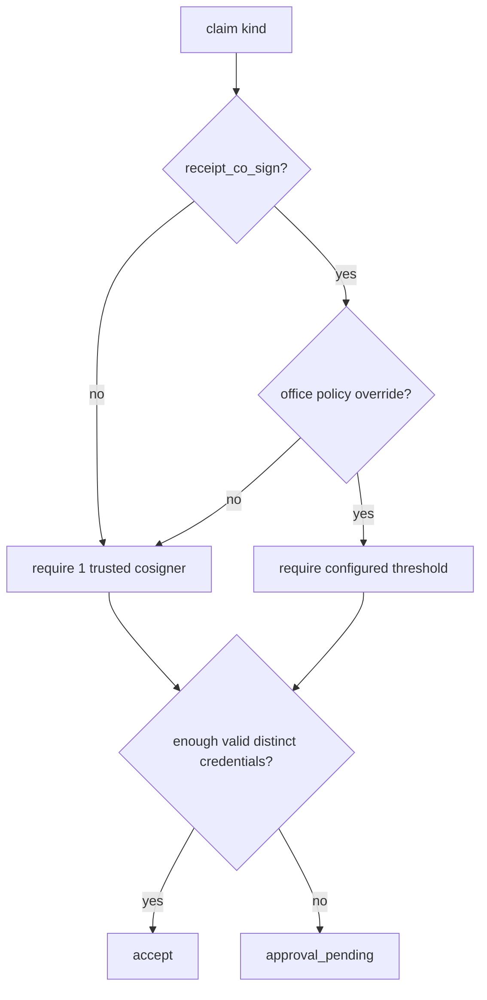
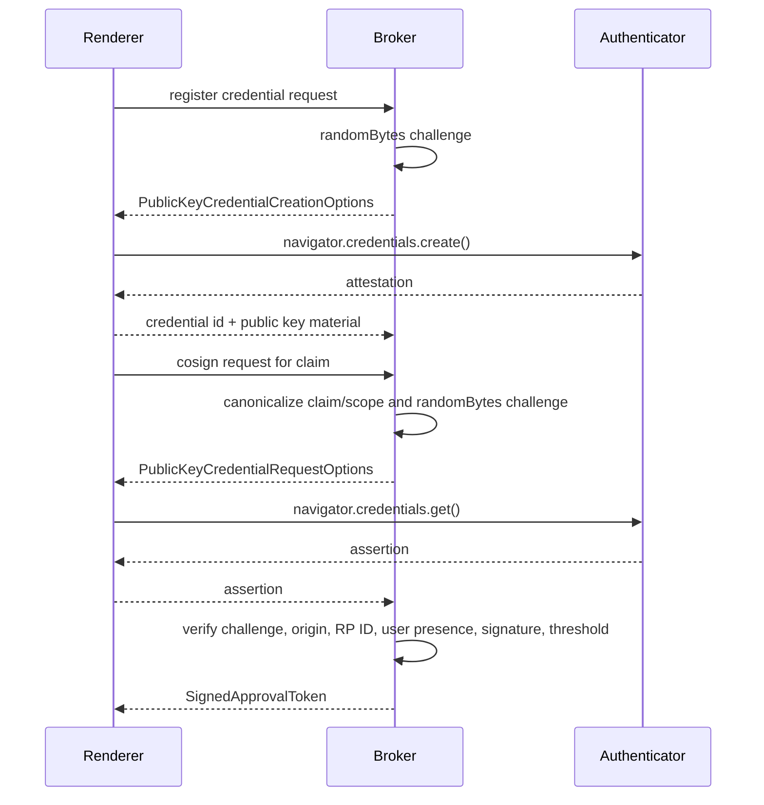
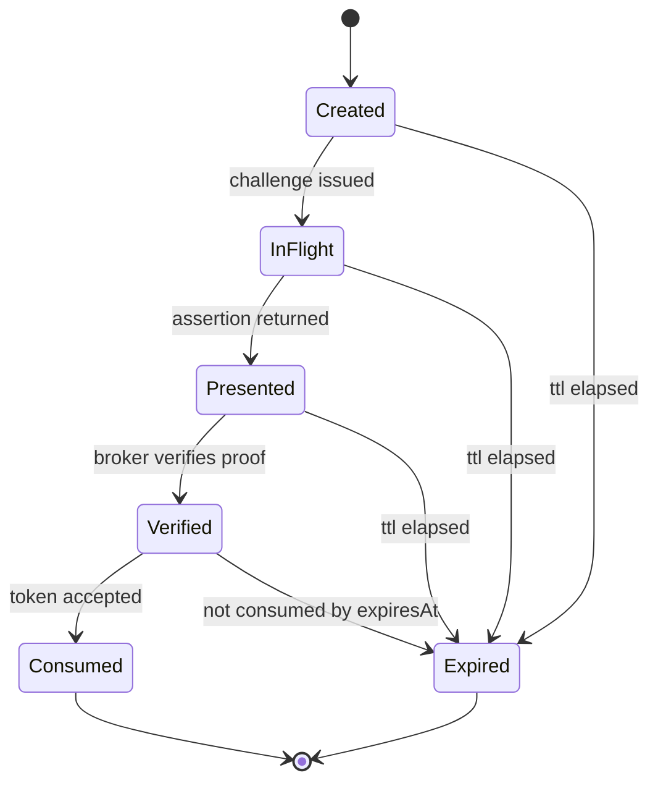

# Branch 12: SignedApprovalToken + WebAuthn Cosign

Branch 12 replaces the current approval proof shape (`{ claims, algorithm:
"ed25519", signerKeyId, signature }` plus optional `webauthnAssertion`) with a
WebAuthn-backed token. The existing shape improves on v0's stringly
`ApprovedBy`, but treats WebAuthn as an opaque claim field. This design makes
the authenticator assertion the proof and keeps replay, expiry, and thresholds
broker-owned.

## Wire Shape

```ts
interface SignedApprovalToken {
  readonly schemaVersion: 1;
  readonly tokenId: ApprovalTokenId;
  readonly claim: ApprovalClaim;
  readonly scope: ApprovalScope;
  readonly notBefore: TimestampMs;
  readonly expiresAt: TimestampMs;
  readonly issuedTo: AgentId;
  readonly signature: WebAuthnAssertion;
}
```

| Field | Why | Budget And Validation |
|---|---|---|
| `schemaVersion` | Pins the wire contract. | Literal `1`; reject all other values. |
| `tokenId` | Broker replay tracking and challenge lookup. | ULID-style 26 ASCII bytes; unique per challenge. |
| `claim` | Human-approved content. | Canonical JSON projection <= 64 KiB; strict known keys; claim-specific brands validated first. |
| `scope` | Capability bounds. | Canonical JSON projection <= 8 KiB; strict known keys; must match `claim.kind` and target fields. |
| `notBefore` | Prevents early use. | Caller-supplied integer epoch milliseconds; no `Date.now()` in protocol code. |
| `expiresAt` | Cleanup and stale-review bound. | Integer epoch milliseconds; `expiresAt > notBefore`; lifetime <= `MAX_APPROVAL_TOKEN_LIFETIME_MS` (30 minutes). |
| `issuedTo` | Presentation audience. | Existing `AgentId` shape, 128 UTF-8 bytes. |
| `signature` | WebAuthn proof. | Structured assertion with base64url `credentialId`, `authenticatorData`, `clientDataJson`, `signature`, optional `userHandle`; total <= 16 KiB. |

Future codecs must reject unknown keys at every object boundary.

Omitted fields: no top-level `nonce`, because the broker challenge is the
unpredictable nonce and is recoverable from `clientDataJson`; no top-level
`audience`, because `issuedTo` plus broker-local challenge state is the v1
audience; no top-level `keyId`, because WebAuthn identifies the public key by
credential id inside the assertion.

## Claim Model

`ApprovalClaim` is a discriminated union:

- `cost_spike_acknowledgement`: approves a runner crossing or approaching a
  cost ceiling. Fields: `claimId`, `agentId`, `costCeilingId`, `thresholdBps`,
  `currentMicroUsd`, `ceilingMicroUsd`.
- `endpoint_allowlist_extension`: approves adding an `openai-compat` endpoint
  at runtime. Fields: `claimId`, `agentId`, `providerKind`, `endpointOrigin`,
  `reason`.
- `credential_grant_to_agent`: approves binding a credential handle to an
  agent. Fields: `claimId`, `granteeAgentId`, `credentialHandleId`,
  `credentialScope`.
- `receipt_co_sign`: approves a receipt or write. Fields: `claimId`,
  `receiptId`, optional `writeId`, `frozenArgsHash`, and `riskClass`.

## Scope And Replay

v1 should be single-use only. Reusable approvals are attractive for repeated
low-risk actions, but they make replay accounting and cross-office policy
harder before the broker has durable token-consumption plumbing. `ApprovalScope`
therefore carries `mode: "single_use"`, the matching `claimId`, `claimKind`,
`maxUses: 1`, and the narrow target fields needed by that claim kind. The
broker consumes `tokenId` atomically after successful verification. Expired,
already-consumed, wrong-agent, wrong-claim, or wrong-target submissions fail
closed.

## Threshold Model



Default threshold is one trusted cosigner. `receipt_co_sign` may be configured
per office because it is the default high-stakes write surface. Policy belongs
in broker config backed by the office record; renderer config can only display
the requirement, not define it.

## WebAuthn Ceremony



Renderer uses `navigator.credentials.create` for registration and
`navigator.credentials.get` for assertions. Broker challenge generation must use
`node:crypto.randomBytes` and bind the challenge to the canonical token preimage
and broker challenge record. Verification should use a vetted library before
hand-rolled crypto. Candidate: `@simplewebauthn/server` 13.x, MIT license,
covers attestation/assertion parsing and browser edge cases. Raw `node:crypto`
is acceptable only for the final ECDSA/EdDSA primitive after a library has
parsed WebAuthn structures.



## Failure Modes

- Challenge expired, unknown, reused, or not bound to the canonical claim/scope.
- Assertion origin, RP ID, credential id, sign count, user presence, or user
  verification fails broker policy.
- Token is presented by an agent other than `issuedTo`.
- Threshold has too few distinct trusted credentials.
- Broker crashes after verification but before consumption; idempotent replay
  must return the same outcome for the same `tokenId`.

## Threat Model

- Malicious renderer mutates claim JSON after the human sees it.
- Agent replays a valid token against another receipt, write, endpoint, or
  credential grant.
- Compromised local process submits stale tokens after the review context has
  changed.
- Phishing origin tries to get a valid assertion for WUPHF's RP ID.
- Supply-chain bug in WebAuthn parsing accepts malformed client data.

## Open Questions

1. Is WebAuthn registration broker-initiated only, or may renderer settings
   start registration without a pending high-stakes claim?
2. Which RP ID and allowed origins apply in dev, packaged desktop, and future
   cloud-backed bridge mode?
3. Should `receipt_co_sign` thresholds count roles (`approver`, `host`) or only
   distinct trusted credential ids?
4. Does branch 12 migrate the existing Ed25519 approval vectors immediately, or
   ship the WebAuthn token beside them for one protocol version?
5. Is endpoint allowlisting tied to branch 11's sanitized `"allowlist"` policy,
   or does the broker own a separate origin-normalization rule?

## File Plan

- `packages/protocol/src/signed-approval-token.ts`: unexported v1 type stub and
  TODO codecs.
- `packages/protocol/src/budgets.ts`: add explicit claim/scope/challenge byte
  caps when codecs land.
- `packages/protocol/src/receipt-types.ts`, `receipt.ts`,
  `receipt-validator.ts`, `ipc.ts`, `ipc-shared.ts`: migrate from the current
  Ed25519 envelope to the WebAuthn token after review.
- `packages/protocol/testdata/*` and `verifier-reference.go`: add canonical
  token vectors before any signed bytes become public.
- `packages/broker/*`: implement registration, challenge storage, assertion
  verification, threshold policy, and replay consumption.
- `apps/desktop/*`: implement credential registration and cosign prompts.
