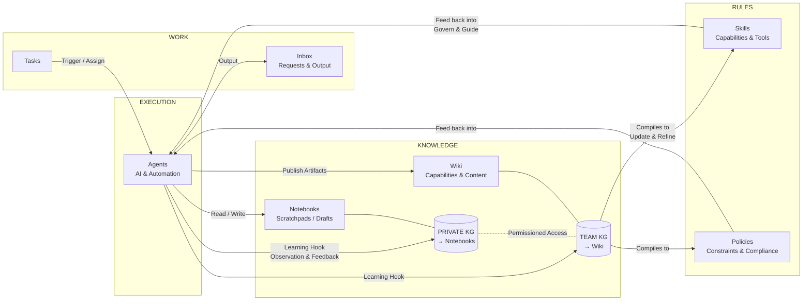

# Spec — The Core Loop (v4): Subtraction-First Rebuild

**Status:** ACTIVE — supersedes `sota-uplift.md` phasing (its shipped substrate — verification gate, context assembler, turn journal, auto-distill, eval harness — is the foundation this builds on). Supersedes all spec/plan-mode/skill-proposal surfaces.
**Author:** Najmuzzaman (directive) + Claude (decisions), 2026-06-10
**Doctrine:** Everything that does not support the core loop is waste. Remove those surfaces from FE and BE. The system stays super focused on delivering this one loop excellently.

▶ **RESUME HERE (2026-06-11 ~04:00): GRADER TOP-3 ALL SHIPPED — eval suite 76/76.** Post-v2-eval fix lane complete on `feat/sota-uplift-phase0` / PR #1062: FIX-1 human-no sovereignty (feedback→packet, human_objection hard-blocks agent approve/complete incl. CEO, reopen discoverable; 52/52), FIX-2 grounding (full titles in packets [the \$61k→\$6k layer], mandatory surfaced RETRIEVED CONTEXT over article files [why CEO claimed "no Acme data"], anti-fabrication prompt block, human_note_pending stop backstop; 64/64), FIX-3 done-means-done (deterministic DoD→verification at create/define, artifact-delta on resubmission, post-done follow-up wakes owner; 76/76). All +4 points of graded headroom implemented. NEXT OPTIONS: (a) v3 live ICP re-run to re-grade (protocol: core-loop-icp-eval.md, baselines 5/10+5.5/10 in .icp-eval/); (b) remaining non-top-3 v2 findings: skills invisible in UI/Compile no-op (N9), entity graph empty of customers live (N7), interview-bar mislabeling (N8), silent Approve-&-Start drafting trap (N5), duplicate-deliverable dedupe (N6), count drift (v1#7), git bulk-path "human" attribution (v1#8), usage pill (v1#9), tool-JSON leaks (v1#12); (c) PR screenshots + mark ready. R6 sweep 2 (transports, packet-kind audit) still queued.

---

## The Core Loop (canonical — founder's structured version, 2026-06-10)

The simplest end-to-end flow we want to work reliably:

1. **Create a task.**
2. **Define the task clearly** — Goal · Deliverables (and required format) · Success criteria.
3. **Gather missing context + get tool access (with human help)** — human interview captured in the task chat; async requests and approvals handled via **Inbox**.
4. **Spin up the team** — assign owner agent(s); create subtasks where needed.
5. **Agents execute with focused context** — agents continuously write to their **private knowledge graph** and use it to generate personal **notebooks**; notebooks hold pre-task research and post-task deliverables/learnings. Goal: stay focused without loading unnecessary context for everyone.
6. **Deliver an artifact** — every task ships an artifact in the **Wiki/Knowledge Base**; post the artifact link back to the parent task and **Inbox**.
7. **Run a deterministic "learning hook"** (intentional, not at the whim of the LLM):
   1. **Extract structured knowledge** — entities, related entities, associated insights → the **Team Knowledge Graph**.
   2. **Write or update wiki articles** — rich human-readable articles per entity, linked like Wikipedia, with Wikipedia-style citations and media placement; identify playbooks in new insights and draft them; always prefer updating existing articles over creating new ones.
   3. **Compile playbooks into Skills & Policies** at regular intervals — skills can ONLY be created from playbook compilation; policies from playbook compilation AND from human feedback during chat; **always prefer updating an existing skill over creating new ones**, even when that grows a skill's scope, as long as the skill stays under the file-size (token) threshold; **policies are always single-threaded** (one atomic rule per policy).
8. **Activate Skills & Policies for relevant agents** — auto-assigned to all relevant agents at skill/policy creation and during automatic agent creation by the CEO; the CEO can also assign a skill/policy to another agent during chat; assigned skills & policies are **always loaded** in that agent's system context.
9. **Repeat the loop with retrieval + deduping** — new tasks retrieve context on-demand from Notebooks + Wiki (hybrid search); prefer updating existing artifacts over creating redundant ones (prune, expand, correct — even if it just means clearing outdated context).

**Memory tiers implied by step 5 + 7:** private per-agent knowledge graph → generates that agent's notebooks (personal, focused); team knowledge graph → generates the wiki (shared, curated). Both written deterministically by hooks, not ad-hoc LLM whim.

## Architecture map (from the founder's diagrams, 2026-06-10)

Four pillars; KGs are the substrate, notebooks/wiki are their generated views; rules feed back to govern execution.

Pipeline (work → reusable knowledge): Task chat → Artifact (Wiki/KB) → Structured extraction (Knowledge Graph) → Playbooks → Skills & Policies → Future tasks (retrieval + dedupe).

Load-bearing details from the diagrams:
- **Permissioned access** between private (notebooks/private KG) and team (wiki/team KG) knowledge — the private/team boundary is a real access control, not a convention.
- The **learning hook observes execution AND completion** ("Observation & Feedback"), writing facts/insights to both KGs deterministically.
- **Rules govern**: skills (capabilities & tools) and policies (constraints & compliance) are the feedback edge into every agent turn — always loaded.

## Removals (R-phases — the subtraction)

| ID | Remove | Notes |
|---|---|---|
| R1 | **The redactor, completely** | The secrets-redaction pipeline that produced "[REDACTED]" over the user's own plans/drafts/artifact pointers (4 blind approvals in the ICP eval). Distinct check during execution: the approval-card **sanitizer** (PR #684, confused-deputy fix for agent-controlled strings inside structured approval payloads) is a separate security boundary — verify separation; if intertwined, preserve the sanitizer's invariant and flag. |
| R2 | **Spec creation + the spec surface** | IssueDraftSpec, CEO draft-writer, spec rail/freeze on task detail, intake Spec LLM ceremony. The task's understanding lives in the R4 intake interview + the task title/description. |
| R3 | **Plan mode** | PlanFirst toggle, LifecycleStatePlanning, plan packets, plan-approval gates, composer toggle. Replaced by R4's structured understanding (think first, but as dialogue, not a gated document). |
| R4 | **(Replacement)** Bake office-hours-style structured thinking into task intake | The CEO interrogates the task with forcing questions adapted from the office-hours method — goal, deliverable + format, success criteria, status-quo/why-now, narrowest first slice, what to observe — resolving gaps via human interview (chat + Inbox). Output is structured fields on the task (goal/deliverables/success_criteria/access_needed), not a spec document. Success criteria map onto the existing machine-verification gate where checkable. |
| R5 | **Agent skill proposals & request_skill_enable** | team_skill_create action=propose, skill-proposal interviews (the dead-Accept surface), skill nudges. Skills come ONLY from playbook compilation (B3). Keep + harden the SkillOpt mechanics (protected invariants, slow-update markers, bloat gates, consolidation/dedup) as the compiler's quality layer. |
| R6 | **Every other non-loop surface, FE+BE sweep** | Inventory in execution: Dashboard/activity app, DMs beyond task channels & #general, decision-packet surfaces not used by interviews/done-posts, legacy /issues remnants, demo seeds, channel ceremony, settle-checklist, unused apps. Opt-in transports (Telegram/OpenClaw/Hermes) deferred to a second sweep — load-time optional, not interfering. Each removal lands as its own commit with the eval suite green. |

## Builds (B-phases — what the loop needs that doesn't exist)

| ID | Build | Builds on |
|---|---|---|
| B1 | **Deterministic completion hook**: on verified done — summarize into parent task, require + link the wiki artifact, post to chat + Inbox, extract entities/associations/insights → TEAM knowledge graph | task_distill.go seam (U4.1), verification gate (U1.1) |
| B2 | **KG → entity wiki articles** with Wikipedia-style linking; kill folder taxonomy (Companies/People/… folders become categories/links) | wiki worker, entity graph (broker_entity*.go), Graph surface |
| B3 | **Playbook detection → playbook articles → interval compilation into skills + policies** with auto-assignment to relevant agents at creation (and at CEO agent-creation time); CEO can reassign in chat; skill UPDATE-FIRST under a token-size threshold (grow scope before creating new); policies single-threaded (atomic) | skill_compile cron, SkillOpt, policies store |
| B4 | **Private per-agent knowledge graph → generated notebooks** (agents continuously write structured knowledge to their private KG; notebooks — pre-task research + post-task deliverables/learnings — are generated views of it) + on-demand hybrid retrieval (wire `internal/embedding` dense path into the U2 retrieval spine) + **"context I used" transparency posts in chat** | context_assembler.go, notebook system, entity graph, U2 |
| B5 | **Wikipedia-parity wiki UX** | Tiptap (already in PR #1018 lineage). **DECISION FLAG:** docmost is AGPL-3.0; WUPHF is MIT — embedding docmost as a library imposes AGPL obligations on every distribution. Recommended: docmost as the UX reference (it's also Tiptap-based), native implementation. If literal docmost embedding is wanted anyway, that's a licensing decision for the founder to make explicitly. |
| B6 | **Update-first knowledge discipline**: retrieval-before-write on every store (notebook/article/policy/skill); prune/extend instead of create; staleness pruning | relevantLearnings seam, wiki lint/archiver |

## How the ICP-eval grader's top-3 fixes are absorbed

1. *Evidence pipeline into gates* → R1 removes the censor; B1 makes the artifact link mandatory in every done post; interviews already carry context.
2. *Make done mean done* → R4 turns success criteria into verification checks at intake; B1 requires the wiki artifact before done; U1.1 gate already enforces machine checks; Reopen must re-engage the owner (fix rides with B1).
3. *Dead skill Accept* → moot: R5 deletes the proposal surface entirely.

## Decisions log

| # | Decision | Why |
|---|---|---|
| C1 | Redactor removal preserves the PR-#684 approval-card sanitizer if separable | Different threat: confused-deputy via agent-controlled strings in approval payloads, not secret-masking |
| C2 | docmost = UX reference, not dependency (pending founder override) | AGPL-3.0 vs MIT distribution |
| C3 | Transports deferred to sweep 2 of R6 | Opt-in at load time; removing them now risks churn without serving the loop |
| C4 | Verification gate + eval harness + turn journal + context assembler + auto-distill SURVIVE | They are the loop's enforcement substrate (success criteria, artifacts, notebooks-as-memory, deterministic learning); eval harness checks get rewritten to assert the loop |
| C5 | Office-hours adoption = its method (forcing questions, narrowest wedge, design-doc discipline), not its gstack plumbing | The preamble/telemetry/config machinery is gstack-specific |
