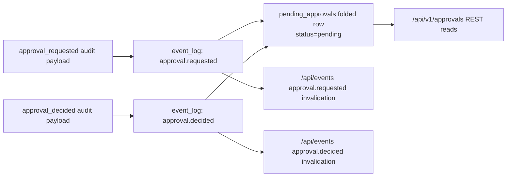

# `src/approvals/*` — explicit approvals

The approvals module owns the broker-side pending approval subsystem for
§15.B D2. Pending approvals are explicit backend events, not derived from
`receipt.approvals[]`.

## Flow



Both commands run inside one `BEGIN IMMEDIATE` transaction: fold the request
from `event_log`, validate against the folded head, append the event, update
`pending_approvals`, and insert the idempotency replay row. A decision is
accepted only while the folded approval is `pending`; a second decision returns
409 and appends no event.

## Projection

Migration `006_approvals.sql` creates `pending_approvals`, a disposable folded
state table keyed by `approval_id`. The row stores canonical JSON for `claim`,
`scope`, and any supplied `SignedApprovalToken`, plus `head_lsn`,
requester/decider identities, timestamps, and optional `thread_id`, `task_id`,
and `receipt_id`.

Status is coupled to decision server-side:

| Decision | Status |
|---|---|
| `approve` | `approved` |
| `reject` | `rejected` |
| `abstain` | `abstained` |

The table has indexes on `status`, `thread_id`, and `task_id`. `thread_id` is
opaque in this PR; PR 3 wires the thread join once `thread_state` exists.

## Routes

All routes inherit the listener's loopback guard and default-deny `/api/*`
bearer gate.

| Method | Path | Request | Response |
|---|---|---|---|
| POST | `/api/v1/approvals` | `ApprovalRequestCreateRequest` route envelope with body `idempotencyKey` | `ApprovalRequestCreateResponse` route envelope |
| GET | `/api/v1/approvals` | Optional `status`, `threadId`, `taskId`, `limit`, `cursor` filters | `ApprovalListResponse` with token-redacted `ApprovalView[]` and optional `nextCursor` |
| GET | `/api/v1/approvals/:id` | none | `ApprovalGetResponse` with one token-redacted `ApprovalView` |
| POST | `/api/v1/approvals/:id/decision` | `ApprovalDecisionRequest` route envelope with body `idempotencyKey`; `approve` requires `token` | `ApprovalDecisionResponse` route envelope; 409 if not pending |

The route layer stamps audit-only fields that are not part of the renderer
route envelope: `requestedAt` / `decidedAt` from the broker clock and
`requestedBy` as `broker`. Decisions require a bearer-bound agent identity and
stamp `decidedBy` to that agent. If a create `idempotencyKey` is itself an
`ApprovalRequestId` ULID, that value becomes the request id; otherwise the
broker derives a stable request id from the key.

SQLite storage errors follow the receipt route contract:
`SQLITE_BUSY`/`SQLITE_LOCKED` returns `503 {"error":"store_busy"}` with
`Retry-After: 1`; `SQLITE_FULL` returns `507 {"error":"store_full"}`; persistent
read-only/IO/corruption errors return `503 {"error":"storage_error"}`.

## SSE

Successful non-replayed writes emit invalidation-only events through
`/api/events`. The broker constructs and validates `ApprovalStreamEvent` before
writing:

```json
{
  "id": "approval_12",
  "kind": "approval.requested",
  "emittedAt": "2026-05-18T12:00:00.000Z",
  "payload": {
    "requestId": "01ARZ3NDEKTSV4RRFFQ69G5FAV",
    "threadId": "01CRZ3NDEKTSV4RRFFQ69G5FA1",
    "headLsn": "v1:12"
  }
}
```

`approval.decided` uses the same payload shape. Consumers should treat these as
cache invalidations and re-query the folded approval if they need full state.

## Public Subpath

`@wuphf/broker/approvals` exports:

| Area | Exports |
|---|---|
| Projection | `createApprovalProjection`, `ApprovalProjection`, `FoldedApprovalRow`, `foldApprovalFromLog` |
| Appender | `createApprovalAppender`, `ApprovalAppender`, append result/error types |
| Idempotency | `parseApprovalIdempotencyKey`, `APPROVAL_COMMAND_VALUES`, `DEFAULT_APPROVAL_IDEMPOTENCY_TTL_MS` |
| Replay rebuild | `rebuildApprovalsProjectionFromLog`, `ApprovalProjectionRebuildResult` |
