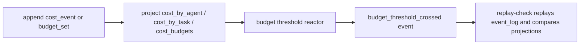

# `src/cost-ledger/*` — cost ledger

The cost ledger records AI gateway spend as an append-only event log, projects
that log into query tables, runs a synchronous budget-threshold reactor, and
exposes the current state through `/api/v1/cost/*` REST routes.

The public broker root remains `createBroker`. Hosts that need to construct or
audit the ledger import primitives from `@wuphf/broker/cost-ledger`.

## Request Flow

## REST Routes

All routes inherit the listener's loopback guard and `/api/*` bearer gate.
Mutation routes additionally require `X-Operator-Identity` and, when
`BrokerConfig.cost.operatorToken` is configured, `X-Operator-Capability`.
If `operatorToken` is absent, broker startup logs
`cost_operator_token_unconfigured` and mutation routes temporarily rely on the
bearer plus operator identity.

| Method | Path | Auth required | Request schema | Response schema | `Idempotency-Key` | `X-Operator-Identity` |
|---|---|---|---|---|---|---|
| POST | `/api/v1/cost/events` | bearer + operator capability | [`CostEventAuditPayload`](../../../protocol/src/cost.ts) JSON | `{ lsn, agentDayTotal, taskTotal, newCrossings }` | Required: `cmd_cost.event_<ULID>` | Required |
| POST | `/api/v1/cost/budgets` | bearer + operator capability | [`BudgetSetAuditPayload`](../../../protocol/src/cost.ts) JSON without trusted `setBy`/`setAt`; the server overwrites both from headers and clock | `{ lsn, tombstoned }` | Required: `cmd_cost.budget.set_<ULID>` | Required |
| DELETE | `/api/v1/cost/budgets/:id` | bearer + operator capability | none | `{ lsn, tombstoned: true }` | Required: `cmd_cost.budget.tombstone_<ULID>` | Required |
| POST | `/api/v1/cost/idempotency/prune` | bearer + operator capability | optional `?olderThanMs=<positive-ms>` query; defaults to 24h | `{ pruned, olderThanMs, cutoffMs }` | none | Required |
| GET | `/api/v1/cost/budgets` | bearer | none | `{ budgets: BudgetRow[] }` | none | none |
| GET | `/api/v1/cost/budgets/:id` | bearer | none | `BudgetRow` | none | none |
| GET | `/api/v1/cost/summary` | bearer | none | `{ agentSpend, budgets, thresholdCrossings }` | none | none |
| GET | `/api/v1/cost/replay-check` | bearer | none | `ReplayCheckReport` | none | none |

`X-Operator-Capability` carries the configured `cost.operatorToken`. The
standard renderer bearer is enough for read routes but not for mutation routes.
`X-Operator-Identity` is parsed as a protocol `SignerIdentity` and becomes the
server-minted `setBy` on `budget_set` audit payloads; budget timestamps are
minted from the broker clock.

Cost-ledger startup runs the same idempotency prune once with the default 24h
TTL. The startup prune is best-effort: failures are logged as
`cost_idempotency_prune_failed`, but the listener still starts. The prune only
deletes `command_idempotency` rows; `event_log`, `cost_by_agent`,
`cost_by_task`, `cost_budgets`, and `cost_threshold_crossings` are retained.

## Invariants

The ledger enforces the §15.A decidable invariants at every committed append:

I1. `sum(cost_events in event_log) == sum(cost_by_agent across all days)`

I2. `sum(task-attributed cost_events) == sum(cost_by_task)`

Taskless cost events intentionally skip `cost_by_task`, so I2 is scoped to the
task-attributed subset. The projections use integer micro-USD amounts
throughout, avoiding float drift in replay comparisons.

## Replay Check

`GET /api/v1/cost/replay-check` runs `runReplayCheck(db)`. It streams
`cost.event`, `cost.budget.set`, and `cost.budget.threshold.crossed` rows from
`event_log`, rebuilds the expected projection state in memory, and compares it
with `cost_by_agent`, `cost_by_task`, `cost_budgets`, and
`cost_threshold_crossings`.

The route returns HTTP 200 when `ok: true` and HTTP 500 when `ok: false`.
Discrepancies include missing or ghost projection rows, total mismatches,
budget field mismatches, threshold-crossing mismatches, and
`event_payload_unparseable` for an event-log row whose payload cannot be parsed
as the expected protocol cost audit payload. That discrepancy carries the LSN,
event type, and parse reason so operators can identify the corrupt row without
losing the rest of the replay report.

## Public Subpath

`@wuphf/broker/cost-ledger` exports the host-facing primitives:

| Area | Exports |
|---|---|
| Event log | `openDatabase`, `runMigrations`, `createEventLog`, `CURRENT_SCHEMA_VERSION`, `EventLog`, `EventLogRecord`, `EventType`, `AppendArgs`, `OpenDatabaseArgs` |
| Idempotency | `parseIdempotencyKey`, `DEFAULT_COMMAND_IDEMPOTENCY_TTL_MS`, `COST_COMMAND_VALUES`, `CostCommand`, `ParsedIdempotencyKey` |
| Projection writer | `createCostLedger`, `CostLedger`, append result types, row types, idempotent append argument/result types |
| Replay check | `runReplayCheck`, `ReplayCheckReport`, `ReplayDiscrepancy` |
