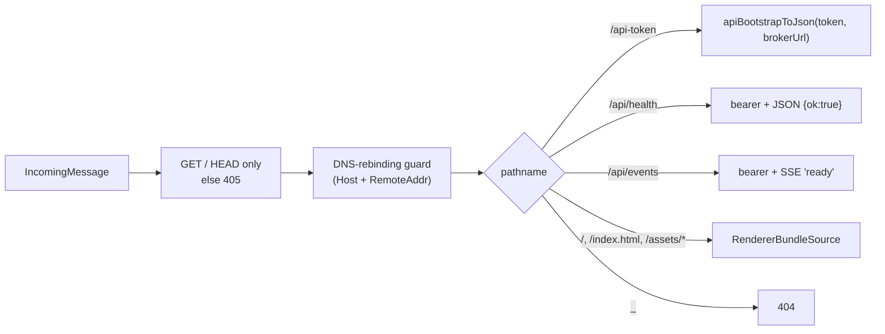

# `src/listener.ts` — broker loopback HTTP+SSE+WebSocket listener

The single entry point for the broker's network surface. Hosts call
`createBroker(config)` and get back a `BrokerHandle` exposing `url`, `port`,
`token`, and `stop()`.

## Bind discipline

`server.listen(port, "127.0.0.1")` is the only bind site in this package. The
host is hard-coded; widening it is forbidden by `AGENTS.md` rule 1 and by the
`check-invariants.sh` grep gate. Browsers, Electron WebViews, and Node clients
all connect over loopback only — there is no LAN, no `0.0.0.0`, no remote
ingress.

## Request pipeline

Every request goes through the DNS-rebinding guard first. `/api-token` is the
only auth-free route — it is the bootstrap that hands the renderer the bearer
it will then use on every subsequent `/api/*` and `/terminal/*` call.

## Wire-shape stability

`/api-token` returns the v0-compatible snake-case JSON `{ token, broker_url }`.
The broker emits this through `apiBootstrapToJson` from `@wuphf/protocol`; that
codec is the single source of truth for the wire shape and is round-trip
verified by both packages' tests.

## WebSocket upgrade

`/terminal/agents/:slug?token=<token>` accepts a WebSocket upgrade subject to
the same DNS-rebinding guard, plus an explicit origin check that allows
absent (Electron WebView / Node client) and loopback origins only. Branch-4
closes accepted upgrades immediately with `1011 not_implemented`; the agent
stdio bridge replaces this in a later branch.

## Static surface

When `RendererBundleSource` is supplied, `/`, `/index.html`, and `/assets/*`
are served from the configured directory with path-traversal protection.
Set `renderer: null` (the default) to disable static serving — useful for
the headless `wuphf serve` path and for dev mode where electron-vite owns
the renderer.

## Lifecycle

`stop()` is idempotent and per-handle: concurrent and follow-up calls share
one closure, so `wss.close` and `server.close` only run once. Active
WebSocket connections receive `1001 server_shutdown`; in-flight HTTP and SSE
streams close on `closeAllConnections()` (Node 18.2+).
