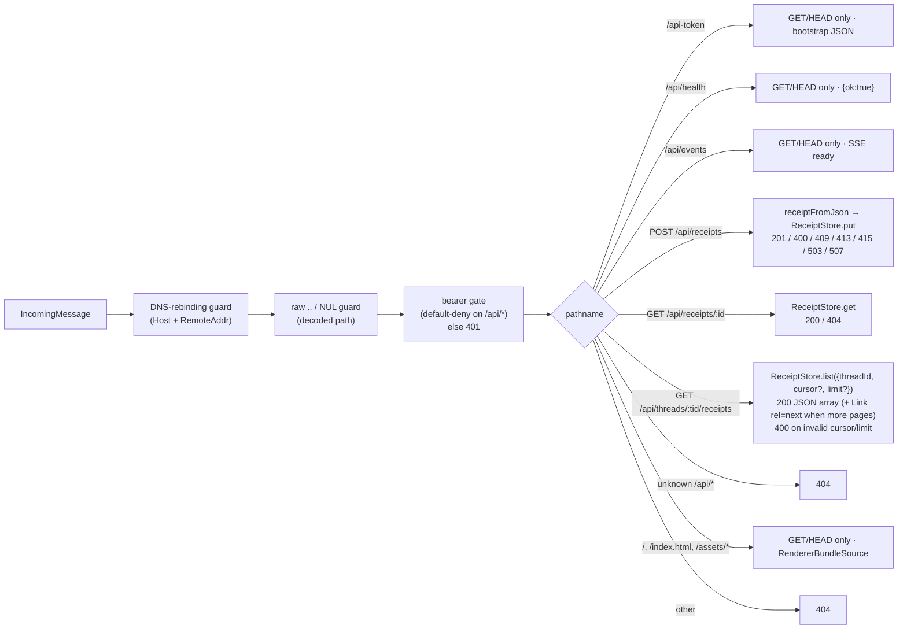

# `src/listener.ts` — broker loopback HTTP+SSE+WebSocket listener

The single entry point for the broker's network surface. Hosts call
`createBroker(config)` and get back a `BrokerHandle` exposing `url`, `port`,
`token`, and `stop()`.

## Bind discipline

`server.listen(port, "127.0.0.1")` is the only bind site in this package. The
host is hard-coded; widening it is forbidden by `AGENTS.md` rule 1 and by the
`check-invariants.sh` grep gate. Browsers, Electron WebViews, and Node clients
all connect over loopback only — there is no LAN, no `0.0.0.0`, no remote
ingress.

## Request pipeline



Every request goes through the DNS-rebinding guard first, then a raw-URL
traversal/NUL guard, then the default-deny bearer gate on the `/api`
namespace (`/api`, `/api/...` — but NOT `/api-token`, which is the
bootstrap). Method enforcement is per-route: each handler emits the
`Allow:` header for its own allowlist, so a `PUT /api/receipts` returns
`405 Allow: POST` and a `POST /api/health` returns `405 Allow: GET, HEAD`.
Authenticated requests to unknown `/api/*` paths return 404 before
falling into static dispatch.

## Wire-shape stability

`/api-token` returns the v0-compatible snake-case JSON `{ token, broker_url }`.
The broker emits this through `apiBootstrapToJson` from `@wuphf/protocol`; that
codec is the single source of truth for the wire shape and is round-trip
verified by both packages' tests.

### Receipt write-path status codes

`POST /api/receipts` distinguishes failure modes so callers can act on them:

| Status | Body | Meaning |
|---|---|---|
| 201 | canonical receipt JSON | inserted |
| 400 | `{"error":"invalid_receipt", reason}` | shape/validator failure |
| 409 | `{"error":"receipt_id_exists", id}` | duplicate `id`; stored value not overwritten |
| 413 | `body_too_large` | body exceeded 1 MiB pre-parse cap |
| 415 | `unsupported_media_type` | non-`application/json` content-type |
| 503 | `{"error":"store_busy"}` + `Retry-After: 1` | transient `SQLITE_BUSY`/`LOCKED`; retry |
| 503 | `{"error":"storage_error"}` | persistent `SQLITE_READONLY`/`IOERR_*`/`CORRUPT`; operator intervention |
| 507 | `{"error":"store_full"}` | `maxReceipts` reached or `SQLITE_FULL` |

### Thread-list pagination

`GET /api/threads/:tid/receipts` accepts `?cursor=<opaque>` (empty value
≡ absent) and `?limit=<positive integer>` (clamped to 1–1000, default
1000). When more pages exist, the response carries:

```http
Link: </api/threads/<tid>/receipts?cursor=<base64url>&limit=<n>>; rel="next"
```

Cursors are opaque RFC 4648 §5 base64url tokens; clients MUST NOT parse
them. The body shape stays a bare JSON array — callers ignoring `Link`
simply see the first page.

## WebSocket upgrade

`/terminal/agents/:slug?token=<token>` accepts a WebSocket upgrade subject to
the same DNS-rebinding guard, plus an explicit origin check that allows
absent (Electron WebView / Node client) and loopback origins only. Branch-4
closes accepted upgrades immediately with `1011 not_implemented`; the agent
stdio bridge replaces this in a later branch.

## Static surface

When `RendererBundleSource` is supplied, `/`, `/index.html`, and `/assets/*`
are served from the configured directory with path-traversal protection.
Set `renderer: null` (the default) to disable static serving — useful for
the headless `wuphf serve` path and for dev mode where electron-vite owns
the renderer.

## Lifecycle

`stop()` is idempotent and per-handle: concurrent and follow-up calls share
one closure, so `wss.close` and `server.close` only run once. Active
WebSocket connections receive `1001 server_shutdown`; in-flight HTTP and SSE
streams close on `closeAllConnections()` (Node 18.2+).
