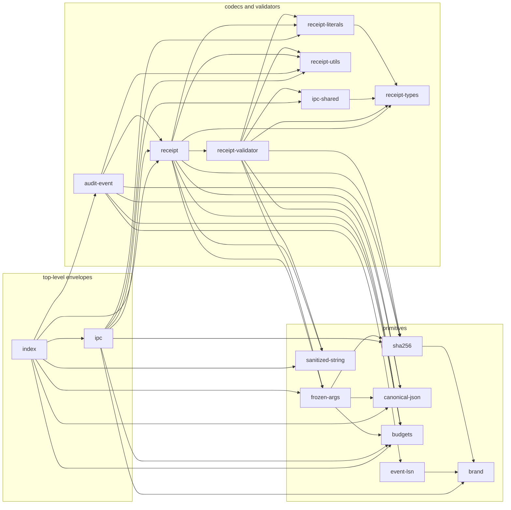
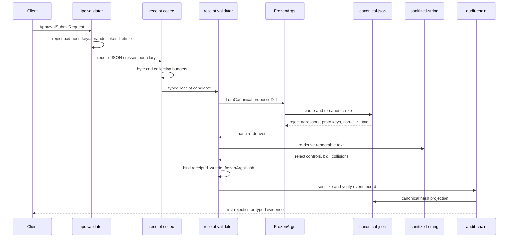
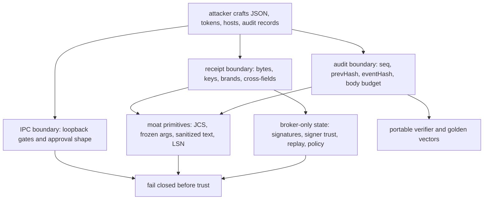

# @wuphf/protocol — Overview

> Public surface, module map, system invariants, and the moat composition.
> If you only read one doc, read this. If you need depth on a module, follow
> the link to `docs/modules/<name>.md`.

## 1. What this package is

`@wuphf/protocol` is a pure-data TypeScript protocol library: branded types,
validators, codecs, and deterministic byte projections with no filesystem,
network, SQLite, or keychain I/O. It is the in-process contract for broker
boundaries and the wire contract mirrored by the Go reference verifier for the
audit chain, receipts, approval tokens, and IPC envelopes.

## 2. Module map

Arrows point from importer to runtime dependency; type-only imports used only to
describe helper inputs are omitted.

Detailed docs: [moat primitives](modules/moat-primitives.md),
[budgets](modules/budgets.md), [receipt](modules/receipt.md),
[audit-event](modules/audit-event.md), and [ipc](modules/ipc.md).

## 3. The moat composition

## 4. System invariants (cross-module)

1. Receipt and audit bytes share [canonical-json](modules/moat-primitives.md):
   `receiptToJson`, `FrozenArgs`, and audit hash projection use the same JCS
   discipline.
2. Brands are not runtime proof. [receipt](modules/receipt.md),
   [ipc](modules/ipc.md), and [audit-event](modules/audit-event.md) re-check
   branded fields at boundaries.
3. Approval tokens bind across layers: [ipc](modules/ipc.md) validates shape and
   request `receiptId`; [receipt](modules/receipt.md) validates receipt, write,
   and `FrozenArgs.hash` binding.
4. Budgets fail first. [budgets](modules/budgets.md) caps run before receipt
   decoding, audit serialization, token lifetime checks, and `FrozenArgs` work.
5. Closed enums stay closed: provider, receipt status, write result, audit kind,
   stream kind, and WebSocket frame values are tuple-backed.
6. `EventLsn` orders audit records; `Date` only marks time. See
   [moat primitives](modules/moat-primitives.md) and
   [audit-event](modules/audit-event.md).
7. Unknown keys are rejected at every object boundary by shared key tuples in
   [receipt](modules/receipt.md), [ipc](modules/ipc.md), and checkpoint codecs.
8. Public API is only `src/index.ts`; module docs describe implementation
   surfaces, not subpath imports.

## 5. Wire contract surface

- Audit event canonical projection: `{ seqNo, timestamp, prevHash, payload }`
  without `eventHash`, JCS-encoded, then hashed as
  `sha256(asciiLowerHex(prevHash) || bytes)`. Golden vector
  `e27134d1...6101bb` and the Go verifier keep portability; changing JCS,
  `EventLsn`, base64, genesis, or prev-hash mixing breaks it.
- Receipt JSON shape: schema version `1`, canonical output from
  `receiptToJson`, and strict hostile input through `receiptFromJson`. Unknown
  keys, budget order, date encoding, and `FrozenArgs` envelopes are portable
  constraints.
- Approval token signed envelope: `{ claims, algorithm: "ed25519",
  signerKeyId, signature }`; signatures cover `canonicalJSON(claims)`. Changing
  claim keys, date rules, or token lifetime changes what brokers sign.
- IPC bootstrap and request/response envelopes: v0 bootstrap translates
  `broker_url` to `brokerUrl`; approval submit and broker responses are closed
  shapes. Hand-rolled translation or widened unions break cross-process parity.

## 6. The threat model in one diagram

## 7. Hard rules quick reference

1. Strict unknown-key rejection: [receipt](modules/receipt.md), [ipc](modules/ipc.md), [audit-event](modules/audit-event.md).
2. Wire changes need golden vectors: [audit-event](modules/audit-event.md), [moat primitives](modules/moat-primitives.md).
3. README hash formula must match code: [audit-event](modules/audit-event.md).
4. Validators re-derive, not `instanceof`: [moat primitives](modules/moat-primitives.md), [receipt](modules/receipt.md).
5. Approval tokens bind receipt and diff hash: [receipt](modules/receipt.md), [ipc](modules/ipc.md).
6. `ProviderKind` is closed: [receipt](modules/receipt.md).
7. `EventLsn` safe-integer bound is intentional: [moat primitives](modules/moat-primitives.md).
8. `ExternalWrite` is discriminated: [receipt](modules/receipt.md).
9. No `any`, ignores, or `ts-ignore`: [moat primitives](modules/moat-primitives.md), [receipt](modules/receipt.md), [ipc](modules/ipc.md), [audit-event](modules/audit-event.md), [budgets](modules/budgets.md).
10. Bounded operations are required: [budgets](modules/budgets.md).
11. Public API changes only through `index.ts`: [moat primitives](modules/moat-primitives.md), [receipt](modules/receipt.md), [ipc](modules/ipc.md), [audit-event](modules/audit-event.md), [budgets](modules/budgets.md).
12. Runtime TS surface is camelCase: [ipc](modules/ipc.md), [receipt](modules/receipt.md).
13. Dates mark time only: [receipt](modules/receipt.md), [audit-event](modules/audit-event.md).
14. Coverage ratchets upward: every module's tests, especially [receipt](modules/receipt.md) and [audit-event](modules/audit-event.md), must keep the gate green.
15. Delegated agents must carry these rules: dispatch prompts point to the owning [moat](modules/moat-primitives.md), [receipt](modules/receipt.md), [ipc](modules/ipc.md), [audit](modules/audit-event.md), or [budget](modules/budgets.md) docs.

## 8. Test taxonomy

- Vitest specs in `packages/protocol/tests/*.spec.ts` catch fixed cases,
  validator paths, codecs, brands, loopback guards, and audit-chain behavior.
- Fast-check property tests cover adversarial `FrozenArgs`, sanitizer, and
  receipt round-trip invariants.
- `scripts/demo.ts` imports through `src/index.ts` and smoke-tests public API.
- `testdata/verifier-reference.go` recomputes golden audit vectors in Go.
- `scripts/check-invariants.sh` blocks forbidden date/order and file-size drift.
- Vitest coverage thresholds in `vitest.config.ts` are a one-way ratchet.
- Module docs record review findings and coverage gaps for Phase 3.

## 9. How to add a new …

- Audit-event kind: add `AUDIT_EVENT_KIND_VALUES`, payload metadata/type
  handling, serializer/validator coverage, demo if public, golden vectors, Go
  verifier update, and README migration note if bytes change.
- `ProviderKind`: add one tuple value, keep the brand closed, update exhaustive
  switches, validator/codec tests, and docs.
- IPC envelope: add type, codec/validator, unknown-key tuple, demo case,
  README entry, and golden vector if it affects signed or hashed bytes.
- Budget: add the `MAX_*` constant, `validate*Budget` helper, fail-fast
  composition site, exact-cap and cap+1 tests, and downstream docs.

## 10. Audit findings rolled up from per-module docs

HIGH:
- [receipt](modules/receipt.md): `ReceiptStatus` is literal-only; code accepts
  contradictory snapshots such as `ok` with rejected approval evidence.

MEDIUM:
- [audit-event](modules/audit-event.md): consumer-facing docs need the genesis
  divergence note for `sha256("wuphf:audit:genesis:v1")`.
- [ipc](modules/ipc.md): web client hand-rolls `broker_url` translation instead
  of `apiBootstrapFromJson`.
- [ipc](modules/ipc.md): `apiBootstrapFromJson` accepts any string URL despite
  loopback contract.
- [ipc](modules/ipc.md): SSE and WebSocket unions lack runtime validators.
- [receipt](modules/receipt.md): `approvedAt === issuedAt` currently validates.
- [budgets](modules/budgets.md): AGENTS hard rule omits the plain-data-only
  contract for `validateReceiptBudget`.

LOW:
- [moat primitives](modules/moat-primitives.md): public primitives need concise
  invariant JSDoc.
- [moat primitives](modules/moat-primitives.md): public JCS exports need a
  stable consumer story or removal before release.
- [receipt](modules/receipt.md): ULID error text overstates ULID-shaped regex.
- [receipt](modules/receipt.md): oversized sanitized-string decode errors omit
  JSON pointer context.
- [budgets](modules/budgets.md): receipt budget call sites lack a local
  plain-data contract note.

## 11. Test coverage gaps rolled up from per-module docs

| Module | Gaps |
|---|---|
| [moat primitives](modules/moat-primitives.md) | Direct `sha256` cases; direct `canonicalJSON` negatives; `FrozenArgs` cycles/depth; sanitizer sparse arrays, side props, cycles, and invalid policy. |
| [audit-event](modules/audit-event.md) | Non-null `receiptId` and non-UTF8 vectors; empty incremental batch after state; corrupt resumed state; Merkle root invalid fields; non-`Uint8Array` body rejection. |
| [ipc](modules/ipc.md) | Bootstrap non-loopback/malformed URL; early approval request failures; claim-field mutation table; high/critical WebAuthn requirement; exact token lifetime cap; all response variants; SSE/WS unknowns once validators exist; loopback bypass edge forms. |
| [receipt](modules/receipt.md) | `schemaVersion: 2`; `approvedAt === issuedAt`; status/evidence contradictions; all provider values plus unknown provider; ULID-shaped boundary decision; oversized sanitized-string pointer context. |
| [budgets](modules/budgets.md) | `validateAuditEventBodyBudget` exact cap/cap+1; approval-token lifetime negative and non-finite edges. |
