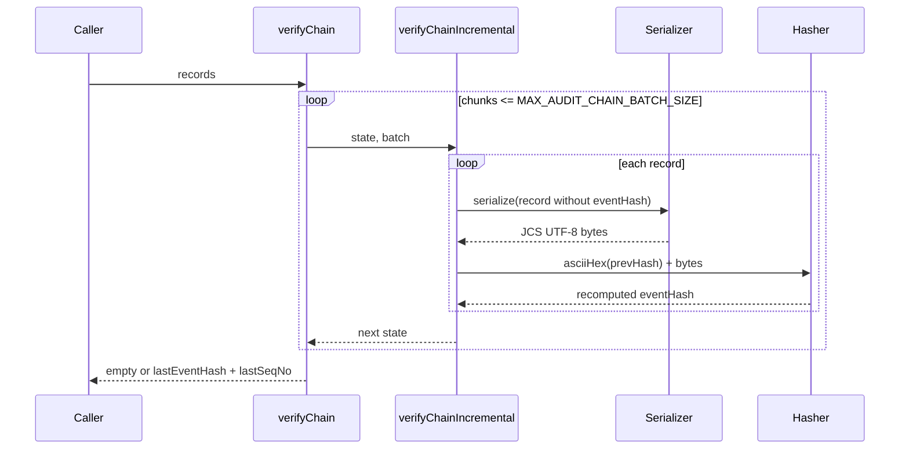
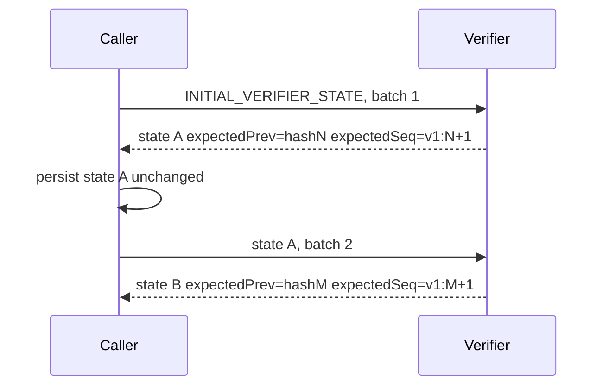
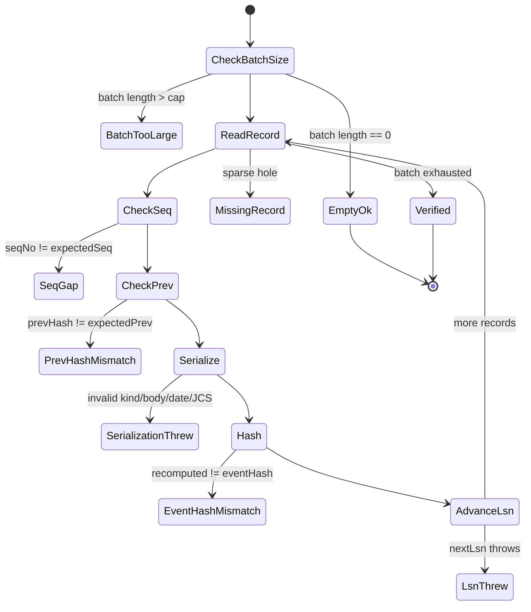
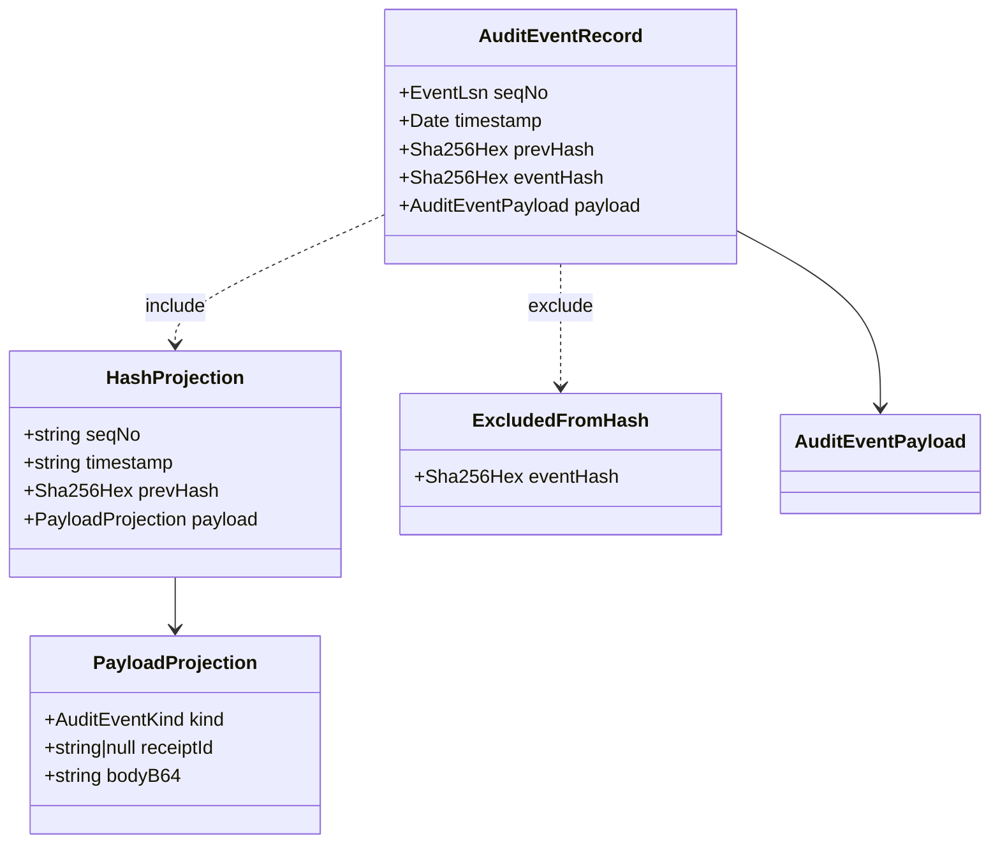

# Module: AUDIT-EVENT

> Path: `packages/protocol/src/audit-event.ts` - Owner: protocol - Stability: stable

## 1. Purpose

This module defines the deterministic audit-chain record shape, canonical hash projection, and chain verifier for WUPHF audit events. It is the package's tamper-evidence boundary: if it is removed or drifts, independent writers and verifiers cannot prove that event order, payload bytes, or Merkle checkpoints are stable across runtimes.

## 2. Public API surface

Types:

| Export | Line | Description |
|---|---:|---|
| `MerkleRootHex` | `audit-event.ts:28` | Branded lowercase SHA-256 digest for a Merkle root. |
| `AuditEventKind` | `audit-event.ts:50` | Closed union of audit payload kinds. |
| `AuditEventPayloadKindMetadata` | `audit-event.ts:52` | Description and schema reference for a kind. |
| `AuditEventPayload` | `audit-event.ts:114` | Opaque event payload bytes plus kind and optional receipt. |
| `AuditEventRecord` | `audit-event.ts:123` | Hash-chained event record including stored `eventHash`. |
| `MerkleRootRecord` | `audit-event.ts:131` | Signed Merkle checkpoint JSON shape. |
| `MerkleRootRecordValidationError` | `audit-event.ts:140` | Path-addressed validation error. |
| `MerkleRootRecordValidationResult` | `audit-event.ts:141` | Success or error-list result for Merkle validation. |
| `ChainFailureCode` | `audit-event.ts:293` | Typed verifier failure discriminator. |
| `ChainVerificationResult` | `audit-event.ts:302` | Full-chain verification result. |
| `ChainVerifierState` | `audit-event.ts:307` | Resumable verifier cursor. |
| `IncrementalVerifyResult` | `audit-event.ts:321` | Per-batch verification result. |

Constants:

| Export | Line | Description |
|---|---:|---|
| `AUDIT_EVENT_KIND_VALUES` | `audit-event.ts:34` | Runtime list backing the closed kind union. |
| `PAYLOAD_KIND_METADATA` | `audit-event.ts:57` | Metadata table keyed by every event kind. |
| `MERKLE_ROOT_RECORD_KEYS` | `audit-event.ts:153` | Strict key set for checkpoint validation. |
| `GENESIS_PREV_HASH` | `audit-event.ts:162` | Domain-separated genesis chain anchor. |
| `INITIAL_VERIFIER_STATE` | `audit-event.ts:314` | Starting verifier state rooted at genesis. |

Functions:

| Export | Line | Description |
|---|---:|---|
| `asMerkleRootHex` | `audit-event.ts:164` | Brands a lowercase SHA-256 root hash or throws. |
| `isMerkleRootHex` | `audit-event.ts:171` | Runtime guard for Merkle root hashes. |
| `validateMerkleRootRecord` | `audit-event.ts:175` | Strict validator for checkpoint records. |
| `merkleRootRecordToJsonValue` | `audit-event.ts:193` | Encodes a checkpoint to JSON-compatible values. |
| `merkleRootRecordFromJson` | `audit-event.ts:208` | Decodes and validates a checkpoint from JSON. |
| `serializeAuditEventRecordForHash` | `audit-event.ts:238` | Builds the JCS UTF-8 hash projection. |
| `computeEventHash` | `audit-event.ts:276` | Hashes ASCII-hex `prevHash` plus projection bytes. |
| `computeAuditEventHash` | `audit-event.ts:289` | Convenience hash over an `AuditEventRecord`. |
| `verifyChain` | `audit-event.ts:331` | Verifies a materialized chain in bounded slices. |
| `verifyChainIncremental` | `audit-event.ts:358` | Verifies one resumable batch. |

Classes: none.

## 3. Behavior contract

1. `GENESIS_PREV_HASH` MUST be `sha256("wuphf:audit:genesis:v1")`, not the older RFC sketch literal `sha256("genesis")`; code and consumer-facing specs MUST call out the divergence.
2. `eventHash` MUST be `sha256(asciiLowerHex(prevHash) || serialize(record))`. `prevHash` is the 64-byte ASCII lower-hex string, not 32 decoded hash bytes and not UTF-16 text.
3. The hash projection MUST include `seqNo`, `timestamp`, `prevHash`, and `payload`; it MUST exclude `eventHash`.
4. The projection MUST encode `seqNo` as the `EventLsn` string, `timestamp` as `Date.toISOString()` with exactly millisecond precision, `payload.receiptId` as the receipt ID string or `null`, and `payload.body` as standard base64 `bodyB64`.
5. The projection MUST be RFC 8785 JCS via `canonicalJSON`, then UTF-8 encoded before hashing.
6. Writers and verifiers MUST both reject payload kinds outside `AUDIT_EVENT_KIND_VALUES`; verifier rejection may surface as `serialization_threw` because verification recomputes through the serializer.
7. Writers and verifiers MUST reject non-`Uint8Array` bodies and bodies over `MAX_AUDIT_EVENT_BODY_BYTES`.
8. `verifyChainIncremental` MUST reject any single batch over `MAX_AUDIT_CHAIN_BATCH_SIZE` before serializing records.
9. `verifyChain` MUST be a convenience wrapper for materialized arrays; it verifies in bounded incremental slices and returns the first failure.
10. `verifyChainIncremental` MUST be resumable only from a prior successful `ChainVerifierState`. Callers MUST preserve `expectedPrev`, `expectedSeq`, `lastSeen`, and `recordsVerified` exactly between batches; the state is not a signed checkpoint.
11. Chain order MUST start at `GENESIS_LSN`, advance with `nextLsn`, and never use wall-clock time for ordering or uniqueness.
12. Each `ChainFailureCode` MUST identify the first failed validation step: `batch_too_large`, `missing_record`, `seq_gap`, `prev_hash_mismatch`, `serialization_threw`, `event_hash_mismatch`, or `lsn_threw`.
13. `MerkleRootRecord` MUST remain distinct from `AuditEventRecord`: it is the signed checkpoint JSON shape for Merkle roots, while the audit event chain commits opaque event payload bytes.
14. Merkle root codecs MUST reject unknown keys, invalid `EventLsn`, non-lowercase SHA-256 root hashes, invalid `Date`, empty key IDs or cert chains, and empty or malformed base64 signatures.

## 4. Diagrams

### 4.1 verifyChain happy path - sequence

### 4.2 verifyChainIncremental resumable walk - sequence

### 4.3 ChainFailureCode - state

### 4.4 AuditEventRecord hash projection - class

## 5. Failure modes

| Input | Expected error or code | Why this matters |
|---|---|---|
| Incremental batch length over `MAX_AUDIT_CHAIN_BATCH_SIZE` | `batch_too_large` | Prevents runaway verification batches before serialization. |
| Sparse array hole | `missing_record` | Stops silent gap skipping in materialized arrays. |
| Record `seqNo` not equal to `expectedSeq` | `seq_gap` | Preserves LSN-anchored order independent of timestamps. |
| Record `prevHash` not equal to verifier state | `prev_hash_mismatch` | Detects branch or splice attacks. |
| Invalid date, payload kind, body type, oversized body, or JCS rejection | `serialization_threw` | Makes malformed or hostile records fail before hashing. |
| Recomputed hash differs from stored `eventHash` | `event_hash_mismatch` | Detects payload, timestamp, sequence, or hash tampering. |
| `nextLsn(expectedSeq)` overflows or rejects | `lsn_threw` | Keeps safe-integer LSN bounds synchronized with the appender. |
| Merkle root unknown key, bad LSN, uppercase hash, invalid date, empty strings, bad base64 | Validation error with JSON path | Keeps checkpoint JSON strict and cross-language portable. |

## 6. Invariants the module assumes from callers

Callers supply typed `AuditEventRecord` values, branded `EventLsn` and `Sha256Hex` fields, and a trusted `ChainVerifierState` returned by a prior successful verifier call. The module validates the chain equations, payload kind, body byte type and size, canonical projection, and Merkle root JSON boundaries; it does not authenticate saved verifier state or interpret opaque payload bodies. Writers with sub-millisecond clocks must truncate before constructing `Date` values.

## 7. Audit findings (current code vs this spec)

| # | Spec section | File:line | Discrepancy | Severity | Fix needed |
|---|---|---|---|---|---|
| 1 | Section 3.1 | `packages/protocol/README.md:11`; external RFC not present in repo | Code documents that `sha256("genesis")` was superseded, and README documents the live literal, but the consumer-facing README/RFC anchor does not repeat the divergence note. | MEDIUM | Update the RFC or README anchor to state that `sha256("wuphf:audit:genesis:v1")` replaces the earlier `sha256("genesis")` sketch. |

## 8. Test coverage gaps (against this spec, not against current code)

| # | Spec section | What's untested | Why it matters | Suggested test |
|---|---|---|---|---|
| 1 | Section 3.4 | Golden vectors cover only `receiptId: null` and ASCII body bytes. | Cross-language readers need proof for non-null receipt IDs and arbitrary opaque bytes. | Add vectors with a real `receiptId` and non-UTF8 body bytes. |
| 2 | Section 3.10 | Empty incremental batch after a non-initial state. | Confirms resumability preserves already-verified state exactly. | Verify a first batch, pass `[]`, and assert returned state identity or equality. |
| 3 | Section 3.10 | Corrupt resumed state behavior. | Documents the trust boundary around persisted verifier state. | Start batch 2 with wrong `expectedPrev` and wrong `expectedSeq`; assert first-record failures. |
| 4 | Section 3.14 | Merkle root invalid `seqNo`, invalid `signedAt`, missing fields, and empty `ephemeralKeyId`. | Merkle root validation is public API and should reject every strict-key boundary. | Add table tests around `validateMerkleRootRecord` and `merkleRootRecordFromJson`. |
| 5 | Section 3.7 | Direct serializer rejection of non-`Uint8Array` body. | Verifier tests cover oversized bodies, but not the body type guard. | Cast a record with `body: []` and assert `serializeAuditEventRecordForHash` throws. |
