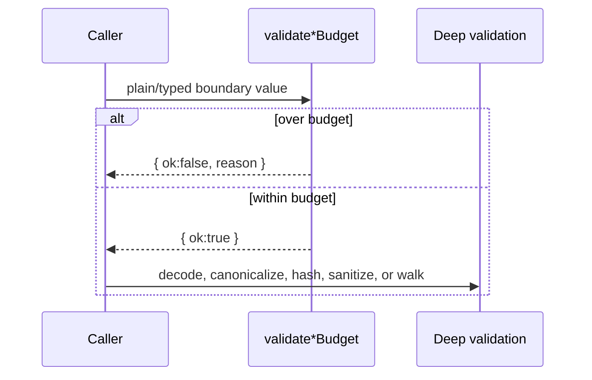
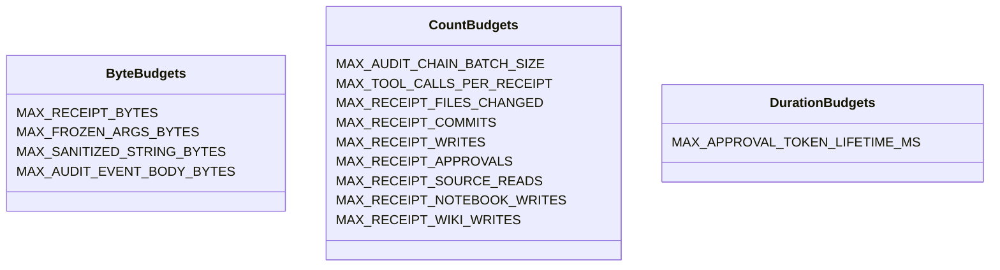

# Module: BUDGETS

> Path: `packages/protocol/src/budgets.ts` · Owner: protocol · Stability: stable

## 1. Purpose

This module is the protocol package's sustainability boundary: every receipt, blob, chain batch, event body, token lifetime, and receipt collection that can grow with input size has a named cap. Without it, validators and serializers in [audit-event](./audit-event.md), receipt, IPC, `FrozenArgs`, and `SanitizedString` could allocate or canonicalize attacker-sized data before discovering semantic invalidity.

## 2. Public API surface

Types:

| Export | File:line | Contract |
|---|---:|---|
| `BudgetValidationResult` | `src/budgets.ts:5` | Result shape for non-throwing budget helpers: `{ ok: true }` or `{ ok: false; reason: string }`. |

Constants:

| Export | File:line | Bound and rationale |
|---|---:|---|
| `MAX_RECEIPT_BYTES` | `src/budgets.ts:13` | 10 MiB serialized receipt. 10x risks verifier/OOM pressure; 0.1x would reject legitimate large task records. Failure stops parse/canonicalization. |
| `MAX_TOOL_CALLS_PER_RECEIPT` | `src/budgets.ts:20` | 1,024 calls. 10x permits runaway loops; 0.1x breaks broad but valid agent runs. Failure stops per-call validation. |
| `MAX_FROZEN_ARGS_BYTES` | `src/budgets.ts:27` | 1 MiB canonical args. 10x stalls JCS/hash work; 0.1x rejects useful structured diffs. Failure stops canonicalization/hash comparison. |
| `MAX_SANITIZED_STRING_BYTES` | `src/budgets.ts:34` | 1 MiB UTF-8 text. 10x overwhelms normalization/UI rendering; 0.1x rejects long logs. Failure stops sanitization or rendering. |
| `MAX_AUDIT_CHAIN_BATCH_SIZE` | `src/budgets.ts:41` | 10,000 records per verifier step. 10x forces huge materialized batches; 0.1x adds avoidable I/O overhead. Failure rejects the batch before record serialization. |
| `MAX_AUDIT_EVENT_BODY_BYTES` | `src/budgets.ts:48` | 1 MiB opaque body. 10x expands base64/JCS/hash memory; 0.1x rejects large receipt/tool payloads. Failure stops event serialization. |
| `MAX_APPROVAL_TOKEN_LIFETIME_MS` | `src/budgets.ts:55` | 30 minutes, policy cap. 10x leaves bearer capabilities stale; 0.1x is too short for human review. Failure rejects token claims. |
| `MAX_RECEIPT_FILES_CHANGED` | `src/budgets.ts:62` | 10,000 file paths. 10x lets generated trees dominate receipts; 0.1x rejects large refactors. Failure stops receipt validation. |
| `MAX_RECEIPT_COMMITS` | `src/budgets.ts:69` | 1,024 commits. 10x turns one receipt into a commit log; 0.1x rejects long rebases. Failure stops receipt validation. |
| `MAX_RECEIPT_WRITES` | `src/budgets.ts:76` | 256 external writes. 10x creates a runaway side-effect ledger; 0.1x blocks bulk operations. Failure stops receipt validation. |
| `MAX_RECEIPT_APPROVALS` | `src/budgets.ts:83` | 64 approval events. 10x becomes a message bus; 0.1x blocks multi-reviewer workflows. Failure stops receipt validation. |
| `MAX_RECEIPT_SOURCE_READS` | `src/budgets.ts:90` | 10,000 citations. 10x crowds out execution data; 0.1x rejects research-heavy tasks. Failure stops receipt validation. |
| `MAX_RECEIPT_NOTEBOOK_WRITES` | `src/budgets.ts:97` | 10,000 notebook refs. 10x becomes an unbounded memory queue; 0.1x rejects import tasks. Failure stops receipt validation. |
| `MAX_RECEIPT_WIKI_WRITES` | `src/budgets.ts:104` | 10,000 wiki refs. 10x becomes an unbounded knowledge-base fanout; 0.1x rejects site updates. Failure stops receipt validation. |

Functions:

| Export | File:line | Contract |
|---|---:|---|
| `assertWithinBudget` | `src/budgets.ts:106` | Throws if value or budget is negative/non-finite, or value exceeds budget. |
| `validateReceiptBudget` | `src/budgets.ts:123` | Non-throwing receipt cap for post-codec plain data only. |
| `validateFrozenArgsBudget` | `src/budgets.ts:156` | Checks `FrozenArgs.canonicalJson` bytes without re-canonicalizing. |
| `validateSanitizedStringBudget` | `src/budgets.ts:164` | Checks sanitized UTF-8 bytes without re-sanitizing. |
| `validateAuditEventBodyBudget` | `src/budgets.ts:172` | Checks raw `Uint8Array.byteLength` before base64/JCS serialization. |
| `validateApprovalTokenLifetime` | `src/budgets.ts:181` | Enforces the 30-minute token lifetime policy. |

## 3. Behavior contract

1. Every growable protocol resource MUST have one exported `MAX_*` cap in this module and consumers MUST import the same constant rather than duplicating values.
2. Budgets MUST run before deeper validation, canonicalization, hashing, sanitization, or per-element walking. `receiptFromJson` checks raw bytes, parsed array lengths, parsed nested byte budgets, decoded typed budgets, then semantic validation; `receiptToJson` checks typed budgets before `validateReceipt` and `canonicalJSON`.
3. `validateReceiptBudget` MUST be used only on plain data: typed receipts or `JSON.parse` output. It may serialize after descriptor-based preflight and MUST NOT be presented as a hostile-object validator.
4. All `validate*Budget` helpers MUST return `BudgetValidationResult`; only `assertWithinBudget` throws.
5. The approval-token lifetime cap is policy, not a tuning knob. Receipt codec/validator paths and IPC approval submission MUST reject claims where `expiresAt - issuedAt > MAX_APPROVAL_TOKEN_LIFETIME_MS`.
6. Audit verification has two axes: `MAX_AUDIT_CHAIN_BATCH_SIZE` limits records per incremental call, and `MAX_AUDIT_EVENT_BODY_BYTES` limits each body before serializer base64 expansion. Both MUST remain wired into default `verifyChain`/`verifyChainIncremental`.

## 4. Diagrams

### 4.1 Fail-fast budget pattern

### 4.2 Receipt decode budget composition

### 4.3 Budget constant groups

## 5. Failure modes

| Input | Expected error message | Why this matters |
|---|---|---|
| Receipt JSON over 10 MiB | `receipt serialized bytes exceeds budget` | Rejects before parsing or canonicalization. |
| Receipt with 1,025 tool calls | `receipt toolCalls length exceeds budget` | Prevents per-item validation from scaling with runaway loops. |
| Frozen args over 1 MiB | `FrozenArgs canonicalJson bytes exceeds budget` | Stops JCS/hash work on oversized arguments. |
| Sanitized text over 1 MiB | `SanitizedString value bytes exceeds budget` | Stops normalization/rendering blowups. |
| Incremental audit batch of 10,001 records | `batch too large` | Keeps verifier batches streamable. |
| Audit body over 1 MiB | `MAX_AUDIT_EVENT_BODY_BYTES exceeds budget` | Prevents base64/JCS expansion before hashing. |
| Approval token lifetime over 1,800,000 ms | `approval token lifetime ms exceeds budget` | Enforces stale-capability policy. |
| Receipt budget called on accessor/toJSON object | Caller contract violation | The helper is plain-data only; hostile wire data must enter through codec parsing. |

## 6. Invariants the module assumes from callers

Callers supply typed values or JSON-plain objects, not proxies, accessors, custom `toJSON`, or forged class instances, unless the specific helper documents runtime hardening. `receiptFromJson` is the hostile wire boundary. Custom audit serializers passed to `verifyChain` inherit responsibility for preserving the per-body cap.

## 7. Audit findings (current code vs this spec)

| # | Spec section | File:line | Discrepancy | Severity | Fix needed |
|---|---|---:|---|---|---|
| 1 | §3.3 | `AGENTS.md:137` | Sustainability rules require budgets, but do not state the `validateReceiptBudget` plain-data-only contract. | MEDIUM | Add the contract to the package hard rule. |
| 2 | §3.3 | `src/receipt.ts:197`, `src/receipt.ts:214`, `src/receipt.ts:220` | Call sites rely on the contract but have no local comment distinguishing parsed plain data from hostile objects. | LOW | Add a concise caller note or link to the budget contract. |

## 8. Test coverage audit

| # | Spec section | Covered edge | Evidence |
|---|---|---|---|
| 1 | §3.4 | `validateAuditEventBodyBudget` accepts exact-cap `Uint8Array` inputs, rejects cap+1, and fails closed for malformed direct-helper inputs. | `tests/budgets.spec.ts` direct helper specs. |
| 2 | §3.5 | `validateApprovalTokenLifetime` accepts exact cap, rejects cap+1 and non-finite date math, and documents lower-bound delegation to receipt/IPC per-field validators. | `tests/budgets.spec.ts` direct helper specs. |
