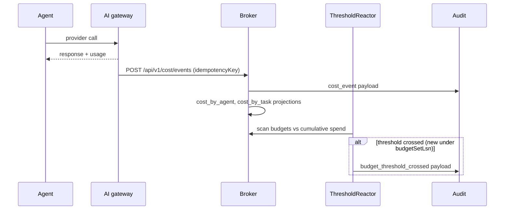
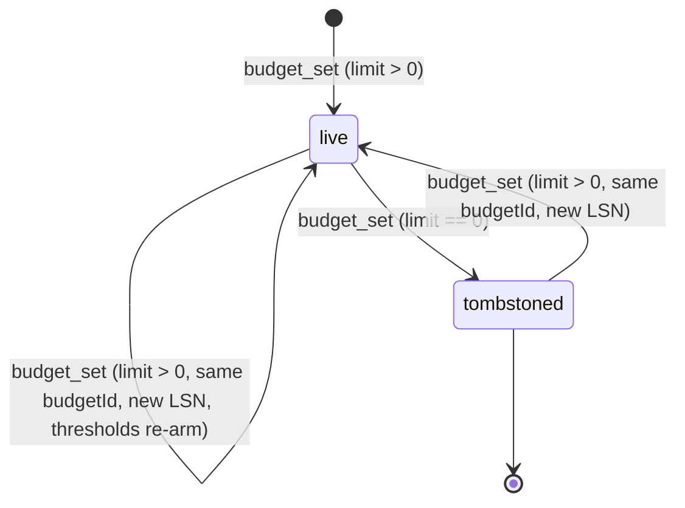
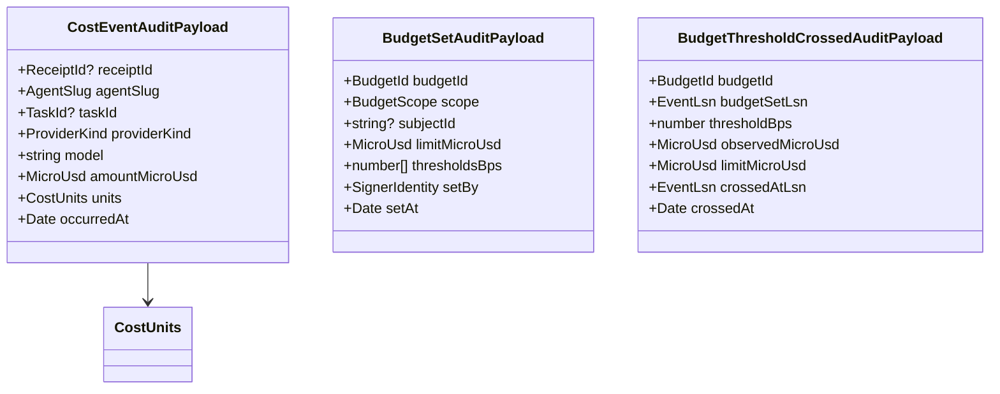

# Module: COST

> Path: `packages/protocol/src/cost.ts` · Owner: protocol · Stability: draft

## 1. Purpose

The cost module is the wire-shape boundary for the AI-gateway cost ledger:
integer-only `MicroUsd` amounts, `BudgetId` ULIDs, `BudgetScope` literals,
`CostUnits` token accounting, and the three audit payloads that drive
projections and enforcement (`cost_event`, `budget_set`,
`budget_threshold_crossed`). It belongs in `@wuphf/protocol` so the broker,
the supervisor, and any cross-language verifier (`testdata/verifier-reference.go`)
agree on byte-identical payloads before the ledger ever holds a row.

Broker-side concerns — `cost_by_agent`, `cost_by_task`, `cost_budgets`,
`cost_threshold_crossings`, the threshold-crossing reactor, idempotency-key
storage, route handlers — are deliberately deferred to
`packages/broker/src/cost-ledger/*`. The protocol package never executes I/O;
it only locks the shape.

## 2. Public API surface

Types:

| Export | File:line | Contract |
|---|---:|---|
| `BudgetId` | `src/cost.ts:81` | ULID-shaped brand. One live row per `(scope, scopeKey)`; tombstones (`limitMicroUsd === 0`) retain the row for replay. |
| `MicroUsd` | `src/cost.ts:104` | Non-negative safe-integer brand. 1 unit = 10⁻⁶ USD. Bounded by `MAX_BUDGET_LIMIT_MICRO_USD`. |
| `BudgetScope` | `src/cost.ts:128` | Closed literal union: `global` \| `agent` \| `task`. |
| `CostUnits` | `src/cost.ts:149` | Non-negative integer token counters: `inputTokens`, `outputTokens`, `cacheReadTokens`, `cacheCreationTokens`. Cache fields exist so Anthropic-style prompt-caching reads/creations stay separable from regular input tokens. |
| `CostAuditEventKind` | `src/cost.ts:168` | Closed literal union: `cost_event` \| `budget_set` \| `budget_threshold_crossed`. |
| `CostEventAuditPayload` | `src/cost.ts:180` | Per-provider-call cost record. `amountMicroUsd` is integer; `occurredAt` marks time only. |
| `BudgetSetAuditPayload` | `src/cost.ts:203` | Budget upsert/tombstone. `limitMicroUsd === 0` ⇒ tombstone. `subjectId` MUST be absent for `global`, an `AgentSlug` for `agent`, a `TaskId` for `task`. |
| `BudgetThresholdCrossedAuditPayload` | `src/cost.ts:242` | Emitted by the reactor. `(budgetId, budgetSetLsn, thresholdBps)` is unique in the projection so re-arming after a budget bump is automatic. |
| `CostAuditPayload` | `src/cost.ts:276` | Discriminated union over the three payloads above. |
| `CostValidationError`, `CostValidationResult` | `src/cost.ts:285` | Type-alias of `ReceiptValidationError`/`Result` so callers share one shape across modules. |

Constants:

| Export | File:line | Contract |
|---|---:|---|
| `BUDGET_SCOPE_VALUES` | `src/cost.ts:127` | Closed tuple driving exhaustive scope switches. Adding a value is a wire/API change. |
| `MAX_BUDGET_LIMIT_MICRO_USD` | `src/budgets.ts` | 1,000,000,000,000 (= $1M). Per-budget limit ceiling. Keeps long-lived ledger accumulation safely below `Number.MAX_SAFE_INTEGER`. |
| `MAX_BUDGET_THRESHOLD_BPS` | `src/budgets.ts` | 10,000 basis points (= 100%). |
| `MAX_BUDGET_THRESHOLDS` | `src/budgets.ts` | 8 thresholds per budget. Bounds reactor work per budget. |
| `MAX_COST_EVENT_AMOUNT_MICRO_USD` | `src/budgets.ts` | 100,000,000 micro-USD (= $100/call). 10x lets a single rogue call dominate a budget; 0.1x rejects legitimate long-context turns. |
| `MAX_COST_MODEL_BYTES` | `src/budgets.ts` | 128 UTF-8 bytes for `cost_event.model`. Bounds projection key sizes. |

Functions:

| Export | File:line | Contract |
|---|---:|---|
| `asBudgetId`, `isBudgetId` | `src/cost.ts:83`, `:90` | Brand constructor (throws on shape failure) and guard. |
| `asMicroUsd`, `isMicroUsd` | `src/cost.ts:106`, `:118` | Brand constructor and guard. Reject negative, non-integer, or over-cap values. |
| `isBudgetScope`, `isCostAuditEventKind` | `src/cost.ts:132`, `:176` | Closed-enum membership guards. |
| `validateCostAuditPayloadForKind` | `src/cost.ts:288` | Kind-dispatching validator; matches `validateThreadAuditPayloadForKind` in shape so audit-event.ts can wire one helper per family. |
| `validateCostEventAuditPayload`, `validateBudgetSetAuditPayload`, `validateBudgetThresholdCrossedAuditPayload` | `src/cost.ts:299`, `:305`, `:311` | Per-payload validators returning `CostValidationResult`. |
| `costAuditPayloadToJsonValue`, `costAuditPayloadFromJsonValue` | `src/cost.ts:575`, `:624` | JCS-compatible plain-JSON codecs. From-codec constructs a typed payload (with `Date` instances), THEN runs the validator. |
| `costAuditPayloadToBytes` | `src/cost.ts:636` | Convenience wrapper: validate, canonicalize, UTF-8 encode. The bytes audit-event.ts hashes are exactly these. |

## 3. Behavior contract

1. `MicroUsd` MUST stay a non-negative safe-integer brand. Float-USD anywhere
   in the ledger compounds across thousands of events and breaks §15.A's
   two decidable invariants:
   - **I1**: `sum(cost_events in event_log) == sum(cost_by_agent across all days)`
   - **I2**: `sum(task-attributed cost_events) == sum(cost_by_task)`
   `cost_event.taskId` is optional (see §2.`CostEventAuditPayload`); taskless
   events skip the task projection, so I2 is scoped to the task-attributed
   subset. The replay-check drift detector enforces both invariants byte for
   byte. Adding a `MAX_BUDGET_LIMIT_MICRO_USD` per-budget cap is what keeps
   the long-lived ledger total inside `Number.MAX_SAFE_INTEGER`.
2. `BudgetId` MUST be ULID-shaped (Crockford base32, 26 chars). It is minted
   by the broker, not by the protocol package; the protocol package only
   validates shape.
3. `BudgetScope === "global"` MUST have absent `subjectId`. `scope === "agent"`
   MUST have an `AgentSlug` subjectId. `scope === "task"` MUST have a `TaskId`
   subjectId. The codec preserves absence (not `null`) to keep canonical JSON
   minimal — same precedent as `thread.ts:baseRevisionId`.
4. `BudgetSetAuditPayload.thresholdsBps` MUST be a strictly-ascending,
   deduplicated array of integers in `(0, MAX_BUDGET_THRESHOLD_BPS]`,
   bounded in length by `MAX_BUDGET_THRESHOLDS`. The reactor scans this
   array per cost event, so an adversarial budget MUST NOT pin it.
5. `BudgetSetAuditPayload.limitMicroUsd === 0` is the tombstone marker. The
   projection treats the row as deleted, but the event row stays in the log
   for replay. The reactor MUST treat thresholds against a tombstoned budget
   as unreachable.
6. `BudgetThresholdCrossedAuditPayload` MUST carry `budgetSetLsn` so the
   projection's crossings key `(budgetId, budgetSetLsn, thresholdBps)`
   re-arms when a budget is increased or reset. Without it, raising a budget
   silently re-fires existing crossings; with it, the reactor records a
   fresh crossing under the new `budget_set` LSN.
7. `BudgetThresholdCrossedAuditPayload.crossedAtLsn` MUST be the LSN of the
   triggering `cost_event`. The reactor MUST derive crossing time from this
   LSN (or the triggering event's `occurredAt`), never from `Date.now()`.
   Replay must reproduce identical crossings byte-for-byte.
8. `cost_event.occurredAt`, `budget_set.setAt`, and `budget_threshold_crossed.crossedAt`
   are `Date` instances in typed payloads and ISO-8601 strings on the wire.
   They mark time only — never use them for ordering. Ordering is `EventLsn`.
9. `cost_event.model` MUST be UTF-8 byte-bounded by `MAX_COST_MODEL_BYTES`
   so projection grouping keys stay small.
10. The from-JSON codec MUST construct the typed payload first (with `Date`
    instances and brand-checked IDs via `as*`) and THEN run the validator.
    Validating raw JSON records first would force the validator to handle
    ISO-string dates as well as `Date`s, doubling its surface and risking
    drift from the canonical-bytes path used by `costAuditPayloadToBytes`.
11. `costAuditPayloadToBytes` MUST canonicalize via `canonicalJSON`
    (RFC 8785 JCS). The audit-event chain hashes these bytes; any byte-level
    drift between TS and the cross-language verifier
    (`testdata/verifier-reference.go`) is a hash break.

## 4. Diagrams

### 4.1 Cost event flow

### 4.2 Budget lifecycle

### 4.3 Cost payload shape

## 5. Invariants

| # | Invariant | Protocol enforcer |
|---|---|---|
| 1 | `MicroUsd` is non-negative safe integer; per-event bounded by `MAX_COST_EVENT_AMOUNT_MICRO_USD`; per-budget bounded by `MAX_BUDGET_LIMIT_MICRO_USD`. | `asMicroUsd`, `validateMicroUsdField` in `validateCost*AuditPayload` |
| 2 | `BudgetId` is ULID-shaped. | `asBudgetId`, `isBudgetId` |
| 3 | `BudgetScope` is closed; subjectId rules match scope. | `validateBudgetSetAuditPayloadValue` |
| 4 | `thresholdsBps` is ascending, deduplicated, in `(0, MAX_BUDGET_THRESHOLD_BPS]`, length ≤ `MAX_BUDGET_THRESHOLDS`. | `validateThresholdsBpsValue` |
| 5 | `limitMicroUsd === 0` is the tombstone marker; codec preserves the zero. | `validateBudgetSetAuditPayloadValue` + projection contract (broker side) |
| 6 | `BudgetThresholdCrossedAuditPayload` carries `budgetSetLsn` and `crossedAtLsn` (both valid `EventLsn`). | `validateEventLsnField` × 2 |
| 7 | `cost_event.model` ≤ `MAX_COST_MODEL_BYTES` UTF-8. | `validateCostEventAuditPayloadValue` model branch |
| 8 | From-JSON codec constructs typed payload, then validates. | `costEventAuditPayloadFromJsonValue` and its siblings |
| 9 | `costAuditPayloadToBytes` produces canonical JCS bytes hashed identically by `verifier-reference.go`. | Golden vectors in `testdata/audit-event-vectors.json` |
| 10 | `ProviderKind` is a closed enum; adding a member is a wire change. | `PROVIDER_KIND_VALUES`, `asProviderKind` (from `receipt-types.ts`) |

## 6. Failure modes

| Input | Expected error message | Why this matters |
|---|---|---|
| `amountMicroUsd: 1.5` | `/amountMicroUsd must be a non-negative safe integer` | Float drift breaks §15.A invariants I1/I2. |
| `amountMicroUsd: -1` | `/amountMicroUsd must be a non-negative safe integer` | Cost events can never refund; negatives indicate a caller bug. |
| `amountMicroUsd > MAX_COST_EVENT_AMOUNT_MICRO_USD` | `/amountMicroUsd must be at most 100000000` | One adversarial call can otherwise dominate any per-day cap. |
| `scope: "global"` with `subjectId` present | `/subjectId must be absent when scope is global` | Projection key drift between scopes. |
| `scope: "agent"` with non-AgentSlug subjectId | `/subjectId must be a valid AgentSlug when scope is agent` | Wrong-shape projection keys leak across scopes. |
| `thresholdsBps: [5000, 5000]` | `/thresholdsBps/1 must be unique within thresholds` | Reactor would fire the same crossing twice. |
| `thresholdsBps: [9000, 5000]` | `/thresholdsBps/1 must be ascending` | Reactor scan assumes ascending order. |
| `thresholdsBps: []` | `/thresholdsBps must contain at least one threshold` | A budget with no thresholds cannot fire warnings. |
| `model` over `MAX_COST_MODEL_BYTES` | `/model must be at most 128 UTF-8 bytes` | Projection grouping keys would grow without bound. |
| Invalid `EventLsn` in `budgetSetLsn`/`crossedAtLsn` | `/{field} <parseLsn message>` | Re-arming and replay both depend on parseable LSNs. |

## 7. Invariants the module assumes from callers

Callers supply typed values (with `Date` instances and pre-branded IDs) for
direct validators, or JSON-plain objects (with ISO-string dates and unbranded
strings) for the from-JSON codec. The codec runs `as*` brand constructors,
constructs the typed payload, then validates. Custom audit serializers passed
to `verifyChain` MUST hash exactly the bytes produced by `costAuditPayloadToBytes`.

## 8. Audit findings (current code vs this spec)

| # | Spec section | File:line | Discrepancy | Severity | Fix needed |
|---|---|---:|---|---|---|

(No findings — module is new.)

## 9. Test coverage audit

| # | Spec section | Covered edge | Evidence |
|---|---|---|---|
| 1 | §3.1 | `asMicroUsd` rejects negative, non-integer, and over-cap values. | `tests/audit-event.spec.ts` cost-payload-bytes round-trip via `bodyForAuditKind` |
| 2 | §3.4 | Threshold validation rejects empty, duplicate, descending, and over-cap arrays. | `validateBudgetSetAuditPayload` exercised through chain test loop |
| 3 | §3.10 | From-JSON codec round-trips canonical bytes for all three kinds. | `validateCostAuditEventBodyBytes` path inside `validateAuditEventPayloadBody` |
| 4 | §3.11 | Canonical bytes are stable across runs. | Pending: `testdata/audit-event-vectors.json` cost vectors (this PR) |
