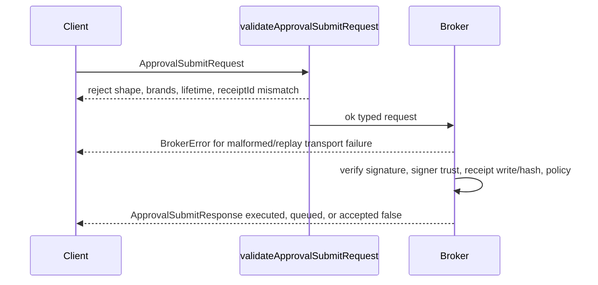
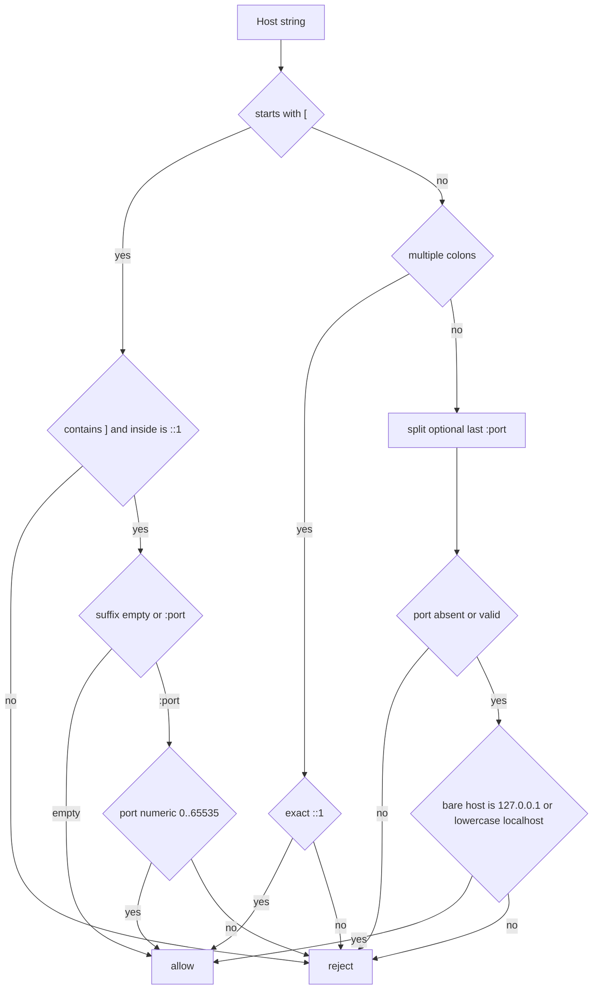
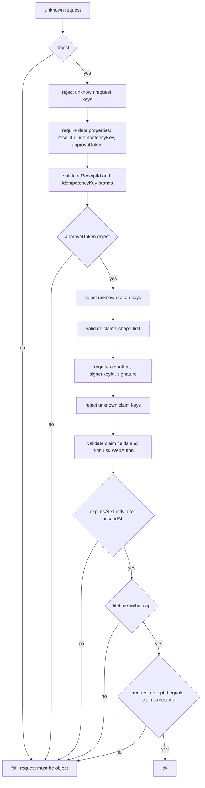
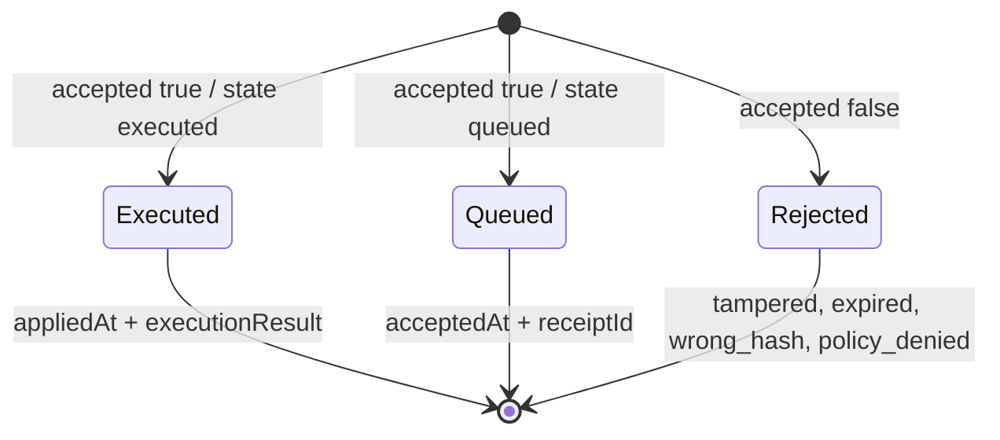

# Module: IPC

> Path: `packages/protocol/src/ipc.ts`, `packages/protocol/src/ipc-shared.ts` - Owner: protocol - Stability: stable

## 1. Purpose

This module defines the pure-data IPC contract for Wuphf's broker boundary: renderer/main OS verbs, loopback HTTP envelopes, approval submission, SSE projections, WebSocket frames, and DNS-rebinding loopback checks. It belongs in `@wuphf/protocol` because downstream packages need the same branded types and validators without importing I/O, Electron, HTTP servers, or keychain code. Removing it would leave bearer-token bootstrap, approval submission, and loopback security checks stringly typed across processes.

## 2. Public API surface

Types in `ipc.ts`:

- `BrokerPort`: integer broker listener port, 1..65535.
- `ApiToken`: bounded base64url bearer token.
- `BrokerUrl`: bare canonical loopback HTTP origin for bootstrap and client
  loading.
- `RequestId`: bounded request correlation identifier.
- `KeychainHandleId`: opaque main-process keychain handle identifier.
- `OsVerbsApi`: renderer-to-main OS verb bridge.
- `ApiBootstrap`: camelCase runtime bootstrap shape for the snake_case wire
  object.
- `BrokerHttpRequest<TBody>`: typed broker HTTP request envelope.
- `BrokerHttpResponse<T>` and `BrokerError`: success/error response envelope.
- `ApprovalSubmitRequest` and `ApprovalSubmitResponse`: approval submission
  contract.
- `StreamEventKind`, `StreamEvent<TPayload>`, `ThreadStreamEvent`, and
  `ThreadInvalidationPayload`: closed SSE projection types.
- `BackpressureFrame`, `WsFrame`, and `WsFrameType`: closed WebSocket frame
  types.
- `AllowedLoopbackHost`: loopback Host allowlist brand.

Functions/constants in `ipc.ts`: `asBrokerPort`, `isBrokerPort`, `asApiToken`,
`isApiToken`, `asBrokerUrl`, `isBrokerUrl`, `asRequestId`, `isRequestId`,
`asKeychainHandleId`, `isKeychainHandleId`, `apiBootstrapFromJson`,
`apiBootstrapToJson`, `approvalClaimsToSigningBytes`,
`approvalSubmitRequestFromJson`, `approvalSubmitRequestToJson`,
`validateApprovalSubmitRequest`, `STREAM_EVENT_KIND_VALUES`,
`isStreamEventKind`, `WS_FRAME_TYPE_VALUES`, `isWsFrameType`,
`validateThreadStreamEvent`, `ALLOWED_LOOPBACK_HOSTS`, `isAllowedLoopbackHost`,
and `isLoopbackRemoteAddress`.

Shared constants in `ipc-shared.ts`: `APPROVAL_CLAIMS_KEYS` and
`SIGNED_APPROVAL_TOKEN_KEYS`. They stay outside `ipc.ts` so IPC, receipt
codecs, and receipt validators share one key allowlist without import cycles or
duplicated literal tuples.

## 3. Behavior contract

1. The runtime TypeScript surface MUST stay camelCase. The v0 bootstrap wire shape is `{ token, broker_url }`, and `apiBootstrapFromJson` / `apiBootstrapToJson` MUST be the only translation site between snake_case wire JSON and `ApiBootstrap.brokerUrl`.
2. Brand constructors MUST be the only supported way to materialize IPC brands: broker ports are integers 1..65535; API tokens are URL/header-safe strings of 16..512 chars; request IDs and keychain handle IDs are 1..128 chars starting with alphanumeric and continuing with alphanumeric, dot, underscore, or hyphen.
3. Broker HTTP responses MUST model success statuses 200, 201, 202 with a body, success 204 without a body, and non-success with `BrokerError`. `202 Accepted` is sufficient for queued or preview confirmations; runtime callers own the actual routing.
4. Approval submissions MUST carry only `receiptId`, `approvalToken`, and `idempotencyKey`. They MUST NOT carry mutable proposed payloads; the broker compares token signature and receipt-owned data.
5. `validateApprovalSubmitRequest` MUST reject non-objects, unknown request keys, accessor fields, missing fields, invalid `ReceiptId`, invalid `IdempotencyKey`, non-object tokens, unknown token keys, missing or non-`ed25519` algorithm, non-string signer key IDs, and empty or invalid-base64 signatures.
6. Approval token claims MUST reject unknown keys; require valid signer identity, role, receipt ID, frozen-args hash, risk class, `issuedAt`, and `expiresAt`; validate optional `writeId`; require non-empty WebAuthn assertion for high/critical risk; require `expiresAt` strictly after `issuedAt`; enforce `MAX_APPROVAL_TOKEN_LIFETIME_MS`; and require request `receiptId === approvalToken.claims.receiptId`.
7. The IPC validator MUST NOT verify Ed25519 signatures, current-time expiry, signer trust, write/diff binding, idempotency replay, or broker policy. Those require broker state.
8. `ApprovalSubmitResponse` MUST be one of: accepted/executed with `executionResult`, accepted/queued with `receiptId`, or `accepted: false` with `tampered`, `expired`, `wrong_hash`, or `policy_denied`.
9. SSE `StreamEventKind` and `WsFrame.t` values MUST remain closed wire unions. Adding an event or frame kind requires updating this module, tests, and any runtime validators/codecs.
10. DNS-rebinding defense MUST compose both gates: `isAllowedLoopbackHost(Host)` and `isLoopbackRemoteAddress(peerIp)`. Host validation accepts only `127.0.0.1`, `localhost` case-insensitively, exact unbracketed `::1`, bracketed `[::1]`, and those accepted hostname forms with valid numeric ports where documented. It rejects rebound suffixes, expanded IPv6, bracketed non-IPv6 hosts, malformed ports, spaces, comma lists, and trailing junk.
11. `isLoopbackRemoteAddress` MUST receive a peer IP with no port. It accepts `::1`, IPv4-mapped `::ffff:127.0.0.0/8`, and `127.0.0.0/8`; it rejects wildcard, private non-loopback, link-local, empty, malformed, and port-suffixed inputs. It does not parse `Forwarded` / `X-Forwarded-For`, validate Origin/CORS, resolve DNS, or prove the listener bind address.

### 3.1 BrokerUrl Bootstrap Matrix

`ApiBootstrapWire.broker_url` is the `BrokerUrl` brand on the wire. It MUST be a bare canonical loopback HTTP origin: `http://<loopback>:<explicit-non-default-port>`. The accepted string is exactly `raw === new URL(raw).origin`, so it has no trailing slash, userinfo, path, query, or fragment. HTTP default port `80` is rejected because the URL parser strips it and the input no longer round-trips as an explicit port.

The loopback host allowlist is `127.0.0.1`, `localhost`, and IPv6 loopback `::1`. In a `BrokerUrl` string, IPv6 loopback must use URL brackets as `[::1]`, and `localhost` must already be canonical lowercase because raw/origin equality rejects case-normalized spellings.

| Form | Example | Accepted | Reason |
|---|---|---|---|
| Bare IPv4 loopback origin | `http://127.0.0.1:54321` | Yes | Canonical HTTP origin with explicit non-default port. |
| Bare localhost origin | `http://localhost:1024` | Yes | Canonical lowercase loopback host with explicit non-default port. |
| Bare IPv6 loopback origin | `http://[::1]:1` | Yes | Canonical bracketed IPv6 loopback origin. |
| Trailing slash | `http://127.0.0.1:54321/` | No | `BrokerUrl` is the bare origin; callers append paths themselves. |
| Path | `http://127.0.0.1:54321/foo` | No | Non-origin path data is not part of the brand. |
| Encoded dot-segment | `http://127.0.0.1:54321/%2e%2e` | No | Raw/origin equality rejects parser-normalized path bypasses. |
| Userinfo | `http://u:p@127.0.0.1:54321` | No | Credentials must never ride in the bootstrap origin. |
| Query | `http://127.0.0.1:54321?x=1` | No | Query data is not part of the bare origin. |
| Fragment | `http://127.0.0.1:54321#frag` | No | Fragment data is not part of the bare origin. |
| Default HTTP port | `http://127.0.0.1:80` | No | `new URL` canonicalizes HTTP port 80 away, so the port is not explicit. |
| Missing port | `http://127.0.0.1` | No | Brokers must emit an explicit bound port. |
| Non-HTTP scheme | `https://127.0.0.1:54321` | No | Only loopback `http:` is valid for this local broker channel. |
| File scheme | `file:///etc/passwd` | No | File URLs are not broker origins. |

The canonical conformance vectors for this matrix live in
`testdata/broker-url-vectors.json`. The protocol package enforces them in
`tests/ipc.spec.ts`; renderer and broker-internal mirrors should consume the
same fixture in their own tests.

### 3.2 Upgrade Path

The v0 bootstrap wire object is intentionally closed: only `token` and `broker_url` are valid keys. `apiBootstrapFromJson` MUST reject unknown keys instead of silently accepting additive fields, which preserves the wire-shape invariant against malicious injection. Future fields such as `expires_at`, `capabilities`, or alternate broker URLs require either a new endpoint or explicit version negotiation through a parallel discovery handshake.

## 4. Diagrams

### 4.1 Approval Submission - Sequence

### 4.2 Loopback Host Decision - Flowchart

### 4.3 Approval Validator Pipeline - Flowchart

### 4.4 ApprovalSubmitResponse States - State

## 5. Failure modes

| Input | Expected error message | Why this matters |
|---|---|---|
| `{ receiptId, approvalToken, idempotencyKey, extra: 1 }` | `extra is not allowed` | Strict unknown rejection prevents hidden protocol fields. |
| Accessor `approvalToken` property | `approvalToken must be a data property` | Avoids invoking hostile getters during validation. |
| Token `algorithm: "rsa"` | `approvalToken.algorithm must be ed25519` | Keeps the signed-token algorithm closed. |
| `expiresAt === issuedAt` | `expiresAt must be strictly after issuedAt` | Equal timestamps must not mint zero-lifetime capabilities. |
| Lifetime over cap | `exceeds MAX_APPROVAL_TOKEN_LIFETIME_MS` | Prevents stale bearer material from lasting beyond the cleanup window. |
| Host `127.0.0.1.evil.com` | `false` | DNS rebinding must fail on Host, not DNS resolution. |
| Remote `127.0.0.1:1234` | `false` | Callers must strip the peer port before remote-address validation. |

## 6. Invariants the module assumes from callers

Callers provide parsed runtime objects, not raw bytes. Approval claim dates must already be `Date` instances; raw JSON date strings require a codec before `validateApprovalSubmitRequest`. Broker code must strip ports from remote peer addresses, run both loopback checks, perform signature verification and policy decisions, and treat SSE/WebSocket payloads as untrusted until a runtime codec or validator checks them.

## 7. Audit findings (current code vs this spec)

Resolved bootstrap note: `apiBootstrapFromJson` and `apiBootstrapToJson` both enforce the `BrokerUrl` matrix above, including strict unknown-key rejection for v0 bootstrap objects.

| # | Spec section | Surface | Discrepancy | Severity | Fix needed |
|---|---|---|---|---|---|
| 1 | Sec 3.1 | `web/src/api/client.ts` | A caller still hand-rolls `{ broker_url } -> brokerUrl` instead of using `apiBootstrapFromJson`, so the codec is not the only translation site repo-wide. | MEDIUM | Route `/api-token` parsing through the protocol codec or document this as an intentional non-package boundary. |
| 2 | Sec 3.9 | `StreamEventKind` and `WsFrame` in `packages/protocol/src/ipc.ts` | `StreamEventKind` and `WsFrame` are closed wire unions but have no exported runtime validators/codecs. | MEDIUM | Add reader/writer validators for SSE and WebSocket envelopes, or explicitly mark them type-only internal surfaces. |

## 8. Test coverage gaps (against this spec, not against current code)

| # | Spec section | What's untested | Why it matters | Suggested test |
|---|---|---|---|---|
| 1 | Sec 3.5 | Top-level unknown request keys, missing request fields, non-object `approvalToken`, invalid `ReceiptId` | Confirms every early failure exit in the public validator. | Table-test the first half of the pipeline. |
| 2 | Sec 3.5-3.6 | Invalid signer identity, role, claims receipt ID, `writeId`, hash, risk class, invalid dates, non-base64 signature | Current tests sample key paths but not every claim validator. | One table with field mutation and expected reason regex. |
| 3 | Sec 3.6 | High/critical risk without non-empty WebAuthn assertion | This is a policy-relevant shape check. | Test high and critical reject empty/missing assertion and low accepts missing assertion. |
| 4 | Sec 3.6 | Lifetime exactly at `MAX_APPROVAL_TOKEN_LIFETIME_MS` through `validateApprovalSubmitRequest` | Budget tests cover the helper; IPC should prove it wires the helper correctly. | Build an approval request at the exact cap and expect `{ ok: true }`. |
| 5 | Sec 3.8 | `executed` and `accepted: false` response variants | Only `queued` is compile-smoked today. | Add type-level examples or runtime fixtures for all union arms. |
| 6 | Sec 3.9 | SSE and WebSocket unknown `kind` / `t` rejection | Wire unions need runtime rejection once validators exist. | Add validator tests when `streamEventFromJson` / `wsFrameFromJson` are introduced. |
| 7 | Sec 3.10-3.11 | Loopback edge forms: trailing dot, uppercase IPv4-mapped IPv6, port-suffixed remote, decimal/octal IPv4 lookalikes | These are common DNS-rebinding bypass probes. | Extend the loopback table with expected fail-closed cases. |
