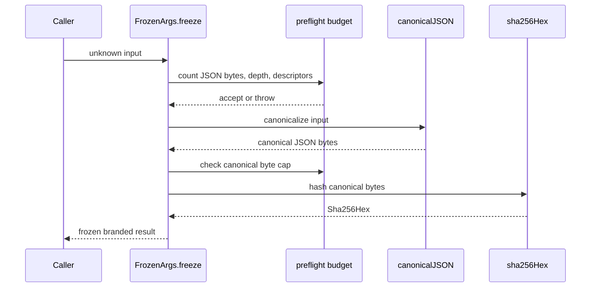
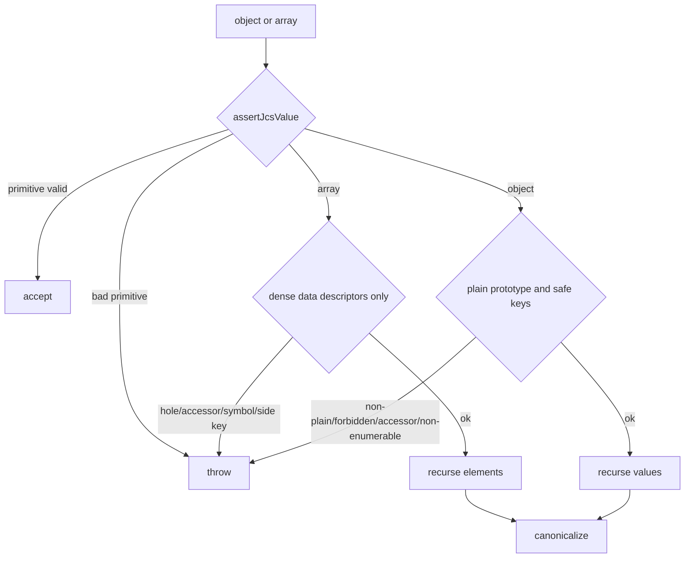
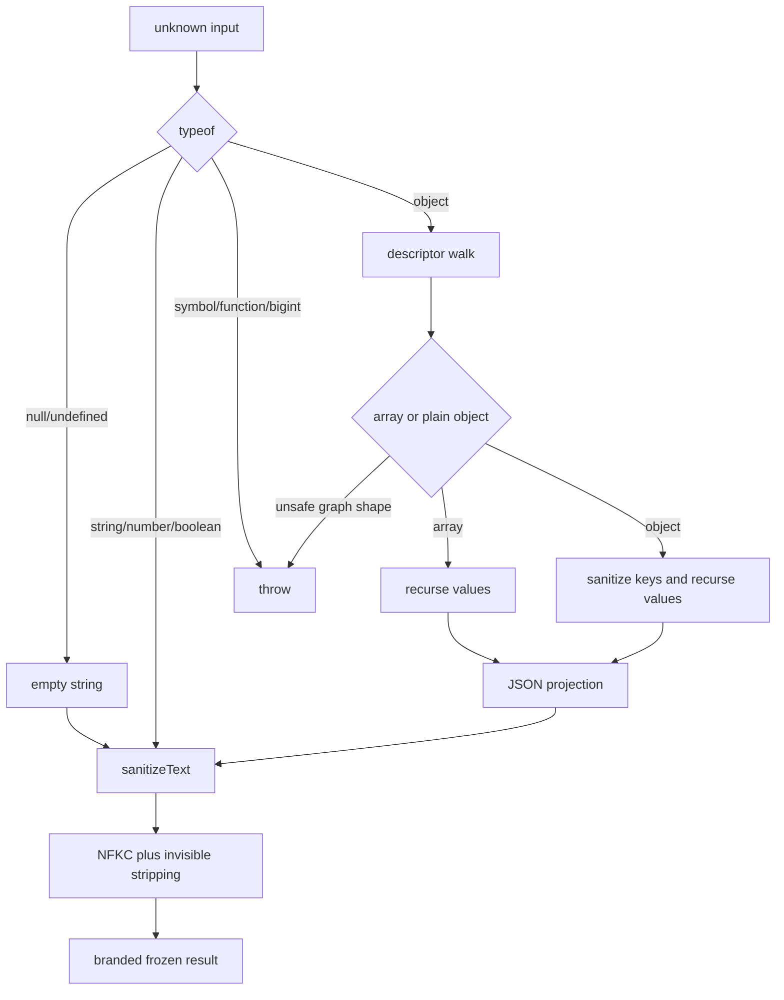
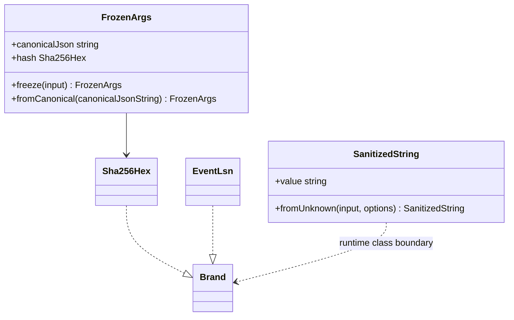

# Module: MOAT PRIMITIVES

> Path: `packages/protocol/src/brand.ts`, `sha256.ts`, `canonical-json.ts`, `frozen-args.ts`, `sanitized-string.ts`, `event-lsn.ts` · Owner: protocol · Stability: stable

## 1. Purpose

These primitives are the protocol moat: each one owns exactly one invariant that higher-level receipt, IPC, and audit code must not reimplement. Removing them would make hashes, rendered text, JSON bytes, and audit ordering depend on caller discipline instead of enforced construction boundaries.

## 2. Public API surface

Types:
- `Brand<T, B>` (`src/brand.ts:3`) - compile-time opaque tag carrier.
- `Sha256Hex` (`src/sha256.ts:4`) - branded lowercase 64-character SHA-256 hex.
- `JsonPrimitive` (`src/canonical-json.ts:6`) - JSON scalar accepted by JCS.
- `JsonValue` (`src/canonical-json.ts:13`) - recursive JSON value accepted by JCS.
- `SanitizedStringPolicy` (`src/sanitized-string.ts:1`) - text sanitization policy: `strip-zero-width` (default denylist), `allow-zwj` (default denylist but keeps U+200D for emoji sequences), or `allowlist` (the moat - strips every `\p{C}` and `Default_Ignorable_Code_Point` code point except tab/newline/carriage return).
- `SanitizedStringOptions` (`src/sanitized-string.ts:3`) - options for text sanitization.
- `EventLsn` (`src/event-lsn.ts:25`) - opaque audit-log position token.
- `ParsedLsn` (`src/event-lsn.ts:59`) - structured parsed LSN union.

Classes:
- `FrozenArgs` (`src/frozen-args.ts:12`) - immutable canonical JSON plus content hash; exposes `canonicalJson` (`src/frozen-args.ts:14`), `hash` (`src/frozen-args.ts:15`), `freeze` (`src/frozen-args.ts:20`), `fromCanonical` (`src/frozen-args.ts:28`), and `equals` (`src/frozen-args.ts:50`).
- `SanitizedString` (`src/sanitized-string.ts:16`) - immutable sanitized renderable text; exposes `value` (`src/sanitized-string.ts:17`), `fromUnknown` (`src/sanitized-string.ts:21`), `length` (`src/sanitized-string.ts:26`), and `toString` (`src/sanitized-string.ts:30`).

Functions:
- `sha256Hex` (`src/sha256.ts:8`) - hash string or bytes to `Sha256Hex`.
- `isSha256Hex` (`src/sha256.ts:14`) - runtime digest guard.
- `asSha256Hex` (`src/sha256.ts:18`) - throwing digest constructor.
- `canonicalJSON` (`src/canonical-json.ts:24`) - RFC 8785 serialization after strict preflight.
- `assertJcsValue` (`src/canonical-json.ts:35`) - assertion-only JCS admissibility guard.
- `lsnFromV1Number` (`src/event-lsn.ts:47`) - mint canonical v1 LSN from a safe integer.
- `parseLsn` (`src/event-lsn.ts:65`) - parse and reject noncanonical LSNs.
- `compareLsn` (`src/event-lsn.ts:90`), `isAfter` (`src/event-lsn.ts:98`), `isBefore` (`src/event-lsn.ts:102`), `isEqualLsn` (`src/event-lsn.ts:110`), `nextLsn` (`src/event-lsn.ts:121`) - LSN ordering helpers.

Constants:
- `GENESIS_LSN` (`src/event-lsn.ts:33`) - first audit-chain sequence token.

## 3. Behavior contract

1. `Brand<T, B>` MUST stay type-only. Runtime safety belongs to constructors and guards such as `asSha256Hex`, `FrozenArgs.freeze`, `SanitizedString.fromUnknown`, and `parseLsn`.
2. `sha256Hex` MUST return lowercase 64-character hex for strings and bytes. `asSha256Hex` and `isSha256Hex` MUST reject uppercase, short, long, and non-hex input.
3. `canonicalJSON` MUST reject anything not representable as stable JCS bytes: `undefined`, functions, symbols, bigint, non-finite numbers, lone surrogate strings or keys, sparse arrays, array side properties, symbol keys, accessor or non-enumerable own properties, non-plain objects, and prototype-pollution keys (`__proto__`, `constructor`, `prototype`). It MUST accept plain objects with `Object.prototype` or `null` prototype.
4. `FrozenArgs.freeze` MUST preflight bounded input before canonicalization, canonicalize with `canonicalJSON`, enforce `MAX_FROZEN_ARGS_BYTES` on canonical bytes, hash those exact bytes, and return an immutable instance. `fromCanonical` MUST parse, re-canonicalize, and reject any string whose bytes are not already canonical.
5. `SanitizedString.fromUnknown` MUST coerce only safe primitives, walk objects and arrays through descriptors before JSON projection, reject getters, callable `toJSON`, inherited enumerable properties, sparse arrays, symbol keys, cycles, non-plain objects, typed arrays, forbidden sanitized keys, and sanitized-key collisions. It MUST normalize strings with NFKC, reject lone surrogates, strip dangerous controls, bidi controls, zero-width characters by default, tags, BOM, U+180E, and U+2060..U+2064; only U+200D may survive under `allow-zwj`. Under the `allowlist` policy (the moat) it additionally strips every Unicode `\p{C}` and `Default_Ignorable_Code_Point` code point - except tab, newline, and carriage return, which every policy preserves as intentional whitespace. It rejects (throws on) a non-plain-object `options` carrier, an inherited or accessor `policy`, and an unknown policy string, so the policy boundary fails closed. The `allowlist` policy resolves those Unicode categories against the host runtime's Unicode tables, so a verifier on a different runtime revision can disagree on code points assigned in the interim; this is a known limitation tracked for cross-language conformance vectors.
6. `EventLsn` MUST use canonical v1 wire form `v1:<decimal-safe-integer>` with no leading zeros, signs, decimals, unsafe integers, or unknown prefixes. `lsnFromV1Number`, `parseLsn`, and `nextLsn` MUST enforce the same safe-integer bound so writers cannot mint verifier-rejected tokens.
7. Public API surface MUST go through `src/index.ts`; subpath exports are not allowed by `package.json`.

## 4. Diagrams

### 4.1 `frozen-args` freeze flow - sequence

### 4.2 `canonical-json` recursive descent - flowchart

### 4.3 `sanitized-string.fromUnknown` walk - flowchart

### 4.4 Brand threading - class

## 5. Failure modes

| Input | Expected error message | Why this matters |
|---|---|---|
| `{ "__proto__": { "polluted": true } }` into `canonicalJSON` or `SanitizedString.fromUnknown` | `forbidden key` | Prevents prototype mutation and key smuggling. |
| Object with getter, accessor `toJSON`, or non-enumerable own field | `accessor property`, `toJSON method`, or `non-enumerable` | Prevents side effects and hidden bytes before hashing or rendering. |
| Sparse array or array with `extra` own property | `sparse array hole` or `non-array-index` | Prevents JSON elision and array/object ambiguity. |
| Lone surrogate in string or key | `lone ... surrogate` | Prevents cross-runtime Unicode serialization drift. |
| NFKC-colliding keys such as `"\uFB01"` and `"fi"` | `sanitized key collision` | Prevents sanitized projection overwrite. |
| `v1:01`, `v1:-1`, `v1:99999999999999999` | `malformed v1 LSN` or `safe-integer range` | Keeps writer and verifier LSN domains identical. |
| Uppercase or short SHA-256 hex | `not a sha256 hex digest` or guard `false` | Keeps hash-chain bytes lowercase and fixed length. |

## 6. Invariants the module assumes from callers

Callers may pass hostile data to `canonicalJSON`, `FrozenArgs.freeze`, `SanitizedString.fromUnknown`, and `parseLsn`; these are boundary APIs. Callers must not treat `Brand` as runtime validation, hand-author `EventLsn` strings, or compare LSNs lexicographically. Receipt validators re-derive `FrozenArgs` and `SanitizedString` instead of trusting `instanceof`; callers that construct typed objects directly must still run the receipt validator and budget validators at the receipt boundary.

## 7. Audit findings (current code vs this spec)

| # | Spec section | File:line | Discrepancy | Severity | Fix needed |
|---|---|---|---|---|---|
| 1 | §3.1-§3.6 | `src/brand.ts:3`, `src/sha256.ts:4`, `src/frozen-args.ts:7`, `src/sanitized-string.ts:16`, `src/canonical-json.ts:18` | Several primitive invariants are documented with no JSDoc or only line comments. The prompt requires the invariant in code JSDoc and tests. | LOW | Add concise JSDoc on each public primitive/type/function boundary. |
| 2 | §3.7 | `src/index.ts:55-56`, `src/canonical-json.ts:6`, `:13`, `:35` | `JsonPrimitive`, `JsonValue`, and `assertJcsValue` are public via `index.ts`, but current repo usage is internal only. This may be intentional, but the stable consumer use-case is undocumented. | LOW | Either remove from public index before release, or document them as stable assertion/typing APIs. |

No current runtime discrepancy was found for the adversarial inputs called out in [lessons-learned](../lessons-learned.md): prototype keys, lone surrogate keys, sparse arrays, accessor descriptors, NFKC collisions, forged `FrozenArgs`/`SanitizedString`, and unsafe LSNs are rejected in the inspected code state.

## 8. Test coverage gaps (against this spec, not against current code)

| # | Spec section | What's untested | Why it matters | Suggested test |
|---|---|---|---|---|
| 1 | §3.2 | Direct `sha256.ts` tests for known digest, `Uint8Array` parity, uppercase rejection, bad length, and non-hex rejection. | Hash brands are used throughout receipt and audit code but lack focused primitive tests. | Add `tests/sha256.spec.ts` covering `sha256Hex`, `isSha256Hex`, and `asSha256Hex`. |
| 2 | §3.3 | Direct `canonicalJSON` tests for non-finite numbers, bigint/function/symbol roots, non-plain objects, non-enumerable object fields, symbol keys, and cyclic objects. | `FrozenArgs` covers many cases indirectly, but `canonicalJSON` is public. | Expand `tests/canonical-json.spec.ts` with direct negative cases and one cycle/depth case. |
| 3 | §3.4 | `FrozenArgs.freeze` circular reference and max-depth preflight behavior. | Preflight is the bounded-operation guard before canonicalization. | Add tests asserting cycles and deep graphs throw before hashing. |
| 4 | §3.5 | `SanitizedString.fromUnknown` sparse arrays, array side properties, and circular arrays/objects. | Object graph walking is the sanitizer's main boundary. | Add table tests for array graph hazards. |
