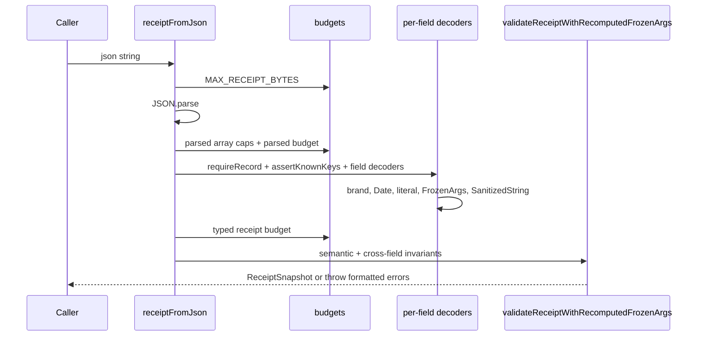
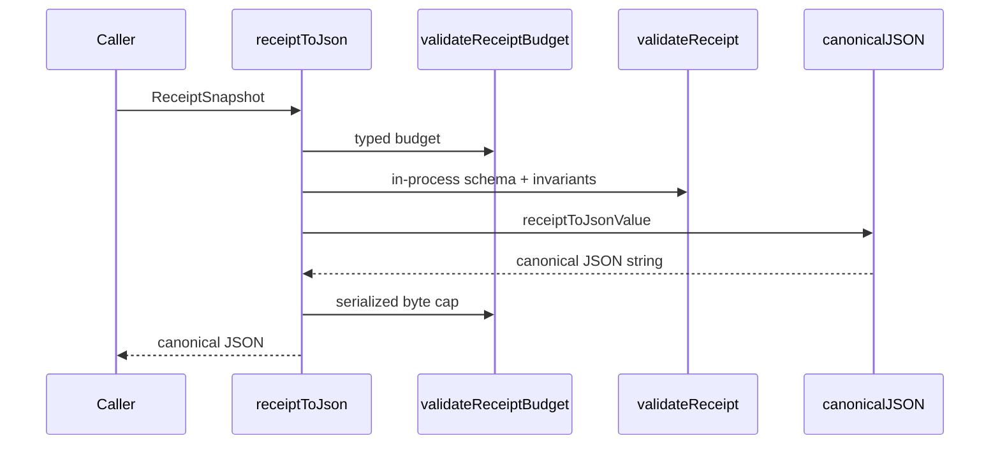
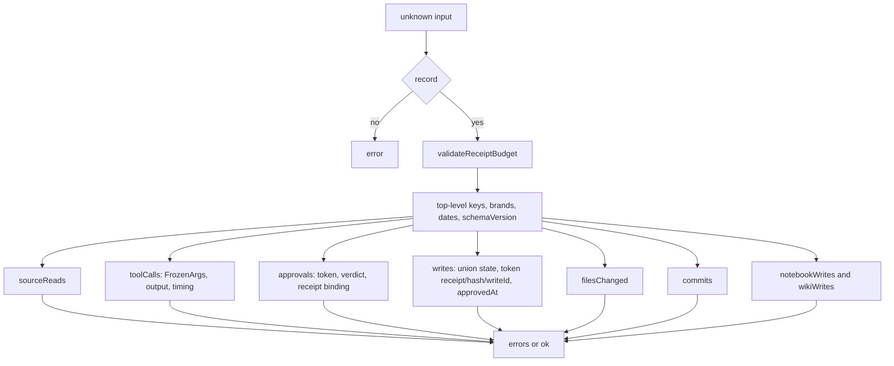
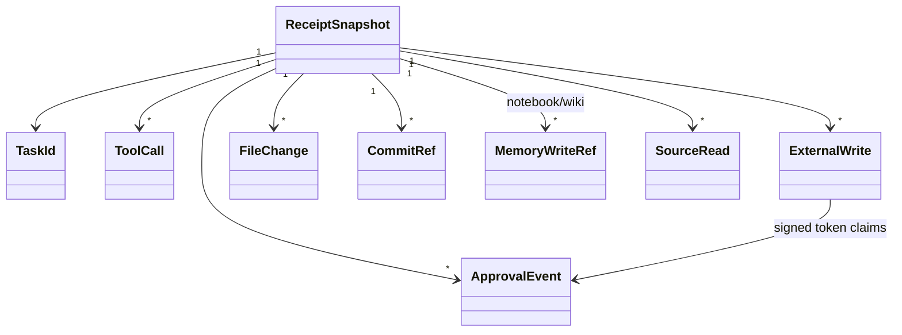
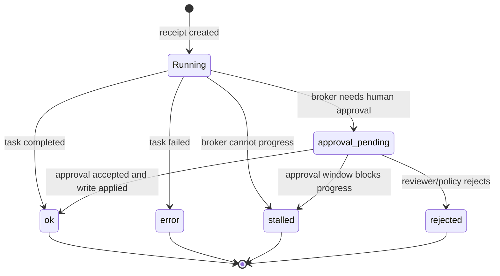

# Module: RECEIPT

> Path: `packages/protocol/src/receipt.ts`, `receipt-types.ts`, `receipt-validator.ts`, `receipt-utils.ts`, `receipt-literals.ts` . Owner: protocol . Stability: stable

## 1. Purpose

The receipt module defines the central evidence artifact for a multi-step agent action: source reads, tool calls, approvals, writes, file changes, commits, and durable memory write references. It belongs in `@wuphf/protocol` so every package shares one no-I/O schema, codec, brand boundary, budget path, and validator. Removing it would make audit evidence stringly typed and would split cross-field approval/write invariants across callers.

## 2. Public API surface

Types:

| Export | File:line | Contract |
|---|---:|---|
| `ReceiptId`, `AgentSlug`, `TaskId`, `ProviderKind`, `ToolCallId`, `ApprovalId`, `WriteId`, `IdempotencyKey` | `src/receipt-types.ts:10-23` | Branded identifiers. `ReceiptId` and `TaskId` match `/^[0-9A-HJKMNP-TV-Z]{26}$/`; this is uppercase ULID-shaped Crockford text, not full ULID range validation. |
| `ReceiptStatus`, `RiskClass`, `WriteResult`, `TriggerKind` | `src/receipt-types.ts:25-46` | Closed string unions shared by codec and validator literals. |
| `SourceRead`, `ToolCall`, `ApprovalEvent`, `FileChange`, `CommitRef`, `MemoryWriteRef` | `src/receipt-types.ts:48-101` | Evidence subrecords for reads, tool calls, approvals, files, commits, and memory references. |
| `ApprovalClaims`, `SignedApprovalToken`, `BrokerTokenVerdict` | `src/receipt-types.ts:103-125` | Signed approval envelope plus broker verification projection. |
| `WriteFailureMetadata`, `ExternalWrite*`, `ExternalWrite` | `src/receipt-types.ts:33-38`, `:133-184` | Discriminated external-write union over `result`, with per-state diff/nullability rules. |
| `ReceiptCore`, `ReceiptSnapshotV1`, `ReceiptSnapshotV2`, `ReceiptSnapshot`, `ReceiptValidationError`, `ReceiptValidationResult` | `src/receipt-types.ts:186-240` | Top-level receipt union and non-throwing validator result. V1 rejects `threadId`; V2 accepts optional `threadId`. |

Constants:

| Export | File:line | Contract |
|---|---:|---|
| `MINIMUM_PROTOCOL_VERSION_FOR_PROVIDER_KIND` | `src/receipt-types.ts:268` | Symbolic rollout floor for cost-event readers that process the widened provider tuple. |
| `PROVIDER_KIND_VALUES` | `src/receipt-types.ts:274` | Closed provider tuple: `anthropic`, `openai`, `openai-compat`, `ollama`, `openclaw`, `hermes-agent`, `openclaw-http`, `opencode`, `opencodego`. Adding a value is a wire/API change and must update exhaustive consumers. |
| `IDEMPOTENCY_KEY_RE` | `src/receipt-types.ts:236` | Public regex for 1..128 char write idempotency keys. |
| `RECEIPT_STATUS_VALUES`, `RISK_CLASS_VALUES`, `WRITE_RESULT_VALUES`, `TRIGGER_KIND_VALUES`, `APPROVAL_ROLE_VALUES`, `APPROVAL_DECISION_VALUES`, `TOOL_CALL_STATUS_VALUES`, `FILE_CHANGE_MODE_VALUES`, `MEMORY_STORE_VALUES`, `APPROVAL_TOKEN_ALGORITHM_VALUES`, `BROKER_TOKEN_VERDICT_STATUS_VALUES`, `BASE64_RE` | `src/receipt-literals.ts:22-93` | Shared literal tuples/regexes. Tuples use `as const satisfies readonly <Union>[]` to prevent codec/validator drift. |
| `RECEIPT_KEYS`, `SOURCE_READ_KEYS`, `TOOL_CALL_KEYS`, `APPROVAL_EVENT_KEYS`, `BROKER_TOKEN_VERDICT_KEYS`, `FILE_CHANGE_KEYS`, `COMMIT_REF_KEYS`, `MEMORY_WRITE_KEYS`, `FROZEN_ARGS_KEYS`, `WRITE_FAILURE_METADATA_KEYS`, `EXTERNAL_WRITE_KEYS`, `APPROVAL_CLAIMS_KEYS`, `SIGNED_APPROVAL_TOKEN_KEYS` | `src/receipt-validator.ts:51-200` | Unknown-key allowlists tied to interfaces with `satisfies readonly (keyof T)[]`. |

Functions:

| Export | File:line | Contract |
|---|---:|---|
| `as*` and `is*` brand constructors/guards for receipt IDs, slugs, task IDs, provider kinds, tool calls, approvals, writes, and idempotency keys | `src/receipt-types.ts:245-316` | Runtime brand boundary. Constructors throw; guards return booleans. |
| `receiptToJson`, `receiptFromJson` | `src/receipt.ts:196`, `:210` | Canonical JSON writer and hostile wire reader. |
| `validateReceipt`, `validateReceiptWithRecomputedFrozenArgs`, `isReceiptSnapshot`, `validateKnownKeys` | `src/receipt-validator.ts:210-265` | In-process validator, codec-assisted validator, type guard, and allowlist helper. |
| `isRecord`, `hasOwn`, `recordValue`, `addError`, `pointer`, `omitUndefined`, `formatValidationErrors`, `requireRecord`, `assertKnownKeys` | `src/receipt-utils.ts:6-59` | Shared low-level codec/validator helpers. |

## 3. Behavior contract

1. The current wire schema versions are `schemaVersion: 1 | 2`. `receiptFromJson` and `validateReceipt` MUST reject any other value. V1 rejects `threadId`; V2 accepts optional `threadId` for thread-linked receipts.
2. Use `receiptFromJson` for untrusted wire JSON. It MUST enforce serialized byte budget, parse JSON, reject over-budget arrays, run parsed plain-data budgets, reject unknown keys at every object boundary, decode each field, rehydrate `FrozenArgs`, then run semantic validation with the recomputed-frozen set.
3. Use `validateReceipt` for in-process runtime objects. It MUST run `validateReceiptBudget` before field walking, then validate brands, dates, literals, arrays, `FrozenArgs`, `SanitizedString`, and cross-field invariants. It is not a raw JSON decoder.
4. `receiptToJson` MUST run typed budgets, semantic validation, canonical JSON serialization, and final serialized byte budget. It MUST omit only `undefined`, never unknown data.
5. Every object boundary MUST reject unknown keys via the matching `*_KEYS` set. Each key tuple MUST use `as const satisfies readonly (keyof T)[]`; reverse drift is guarded by round-trip/property tests and reviewer spot checks.
6. `ProviderKind` MUST remain a closed enum. Additions go through `PROVIDER_KIND_VALUES`, tests, docs, and every exhaustive switch. Do not widen to `Brand<string, ...>`.
7. Dates mark time only. They may validate local order windows, but they MUST NOT provide uniqueness, cross-record ordering, or hash identity.
8. Cross-field invariants MUST be enforced in the validator: approval-token `claims.receiptId` equals the enclosing receipt ID; external-write tokens also bind `claims.frozenArgsHash` to the locally re-derived `proposedDiff` hash; write-scoped tokens bind `claims.writeId` to `ExternalWrite.writeId`; `expiresAt` is strictly after `issuedAt`; and write `approvedAt` is strictly after token `issuedAt`.
9. `ExternalWrite` result states MUST mirror the discriminated union: `applied` requires non-null `appliedDiff` and `postWriteVerify` and no `failureMetadata`; `rejected` requires both diff fields null; `partial` requires non-null `appliedDiff` and nullable verification; `rollback` requires non-null `appliedDiff` and null verification.
10. `ReceiptStatus` is the lifecycle summary. Valid transitions are `approval_pending -> ok`, `approval_pending -> rejected`, `approval_pending -> stalled`, running receipt -> `ok`, running receipt -> `error`, running receipt -> `stalled`; terminal `ok`, `error`, and `rejected` MUST NOT transition further except to corrected audit supersession outside this schema. A terminal snapshot MUST agree with evidence: rejected approvals imply `rejected` or `error`, pending approval evidence implies `approval_pending` or `stalled`, and `ok` must not carry rejected approvals or failed required writes.

## 4. Diagrams

### 4.1 `receiptFromJson` decode pipeline - sequence

### 4.2 `receiptToJson` encode pipeline - sequence

### 4.3 `validateReceipt` walk - flowchart

### 4.4 ReceiptSnapshot composition - class

### 4.5 ReceiptStatus state machine - state

## 5. Failure modes

| Input | Expected error message | Why this matters |
|---|---|---|
| `schemaVersion: 99` | `/schemaVersion: must be 1 or 2` | Prevents silent future-schema downgrade without migration. |
| V1 receipt with `threadId` | `/threadId: must be absent for schemaVersion 1` | Prevents hidden V2 data from being accepted as V1. |
| Unknown top-level or nested key | `<pointer>: is not allowed` | Blocks shadow data and literal drift. |
| `FrozenArgs` envelope with extra sibling | `<pointer>/evilShadow: is not allowed` | Prevents unhashed data smuggling. |
| Forged `FrozenArgs` instance | `<pointer>/hash: does not match canonicalJson` | Re-derives instead of trusting `instanceof`. |
| Forged `SanitizedString` instance | `<pointer>: must already be sanitized` | Blocks bidi/control text hidden behind a prototype. |
| Token `receiptId` mismatch | `must match enclosing receipt id` | Prevents approval reuse across receipts. |
| Token `frozenArgsHash` mismatch | `must match this write's proposedDiff hash` | Prevents approval reuse across write payloads. |
| `result: "applied"` with null `appliedDiff` | `null is invalid for state "applied"` | Keeps external-write union sound. |
| Oversized receipt or nested blob | `exceeds budget` | Fails before unbounded validation, JCS, or sanitization work. |

## 6. Invariants the module assumes from callers

Callers constructing runtime receipts directly must use brand constructors, `FrozenArgs.freeze` or `FrozenArgs.fromCanonical`, and `SanitizedString.fromUnknown`, then run `validateReceipt` before persistence or serialization. Hostile JSON must enter only through `receiptFromJson`. Signature cryptography, signer trust, replay checks, current-time expiry, and broker policy are outside this no-I/O package; receipts record the broker's verdicts and bind them to receipt/write evidence.

## 7. Audit findings (current code vs this spec)

| # | Spec section | File:line | Discrepancy | Severity | Status |
|---|---|---:|---|---|---|
| 1 | 3.10 | `src/receipt-validator.ts:241`, `src/receipt-validator.ts:419` | Historical R11 gap: `ReceiptStatus` was only checked as a literal, so inconsistent snapshots could validate. Current code runs `RECEIPT_STATUS_EVIDENCE_RULES` from `validateReceiptStatusEvidence`. | HIGH | RESOLVED in `872f97d3`; regression tests in `1da5ccfa` / `tests/receipt.spec.ts:1353`. |
| 2 | 3.8 | `src/receipt-validator.ts:960-968` | Historical R11 gap: the write approval ordering check allowed `approvedAt === issuedAt`. Current code passes `allowEqual: false`, so approval must be strictly after issuance. | MEDIUM | RESOLVED in `53a77e87`; equality coverage in `tests/receipt.spec.ts:1074`. |
| 3 | 2, 3.1 | `src/receipt-types.ts:233`, `src/receipt-types.ts:246`, `src/receipt-validator.ts:867` | Error text says ULID, but the regex is ULID-shaped only and allows first characters outside strict ULID timestamp range. | LOW | OPEN: rename messages/docs to ULID-shaped, or tighten the regex to strict ULID range. |
| 4 | 3.2 | `src/receipt.ts:868-876` | Oversized `SanitizedString` decode errors omit the JSON pointer, unlike sibling type/sanitization failures that use `path`. | LOW | OPEN: prefix the budget error with the provided field path. |

## 8. Test coverage status (against this spec, not against current code)

| # | Spec section | Coverage status | Why it matters | Reference / suggested test |
|---|---|---|---|---|
| 1 | 3.1 | Gap: future schema rejection beyond V2. | Locks the versioned migration boundary. | Mutate serialized fixture to `99` and assert `/schemaVersion: must be 1 or 2`. |
| 2 | 3.8 | Covered: `approvedAt === issuedAt` rejects because authorization ordering is strict-after. | Prevents same-instant approval tokens from authorizing writes. | `tests/receipt.spec.ts:1074`. |
| 3 | 3.10 | Covered for core contradictions: `ok` plus rejected approval, `ok` plus failed tool call, `ok` plus non-applied write, pending/stalled with applied writes, and rejected/error without required evidence. | Prevents receipts whose summary contradicts their evidence. | `tests/receipt.spec.ts:1353`, `tests/receipt.spec.ts:1368`, `tests/receipt.spec.ts:1379`, `tests/receipt.spec.ts:1390`. |
| 4 | 3.6 | Gap: all `PROVIDER_KIND_VALUES` accepted and unknown providers rejected through validator and codec. | Closed enums need runtime and type coverage when values change. | Iterate the tuple and add one unsupported value. |
| 5 | 2 | Gap: ULID-shaped but not strict-ULID boundary, especially first char `8` or `Z`. | Forces an explicit decision: accept regex-shaped IDs or enforce strict ULID range. | Test the chosen behavior for `ReceiptId` and `TaskId`. |
| 6 | 3.2 | Gap: oversized nested sanitized strings preserve pointer context. | Debuggability and helper consistency. | Mutate `toolCalls[0].output` over the cap and assert the path appears. |
