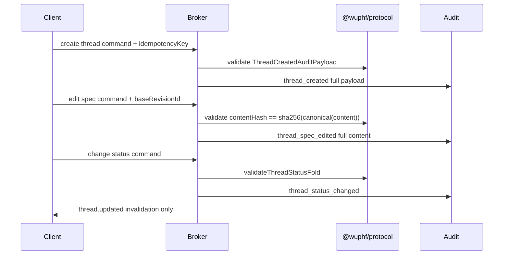
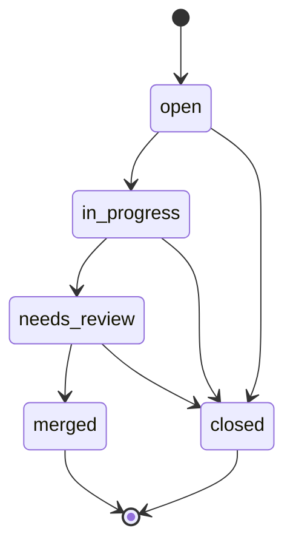
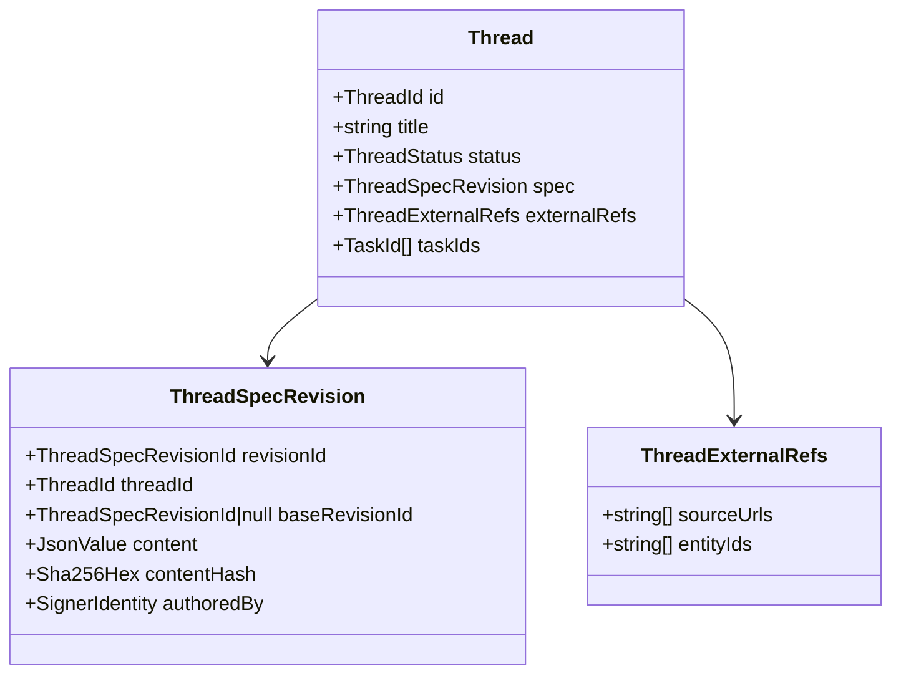
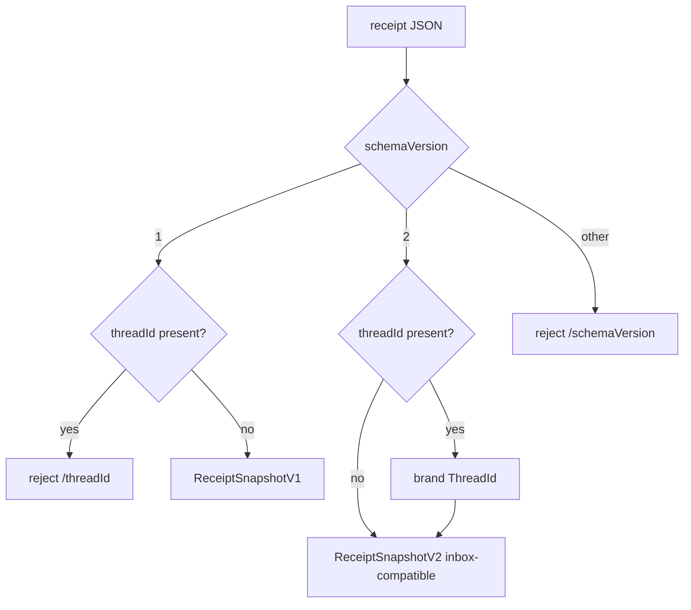

# Module: THREAD

> Path: `packages/protocol/src/thread.ts`, receipt V2 bridge in
> `packages/protocol/src/receipt.ts` · Owner: protocol · Stability: draft

## 1. Purpose

The thread module defines the protocol slice for durable work threads:
bounded branded IDs, thread/spec/external-ref schemas, snake_case wire codecs,
receipt V2 attachment, audit payload validators, status-fold helpers, and
projection assertion helpers. Posts, cross-thread links, renderer surfaces, and
HTTP handlers are deliberately deferred to broker and Stream B work.

## 2. Lifecycle

## 3. Status

## 4. Schemas

## 5. Receipt Version Handling

## 6. Invariants

| # | Invariant | Protocol enforcer |
|---|---|---|
| 1 | Receipt V1 rejects `threadId`; V2 accepts optional `threadId`; both canonical round-trip. | `receiptFromJson`, `receiptToJson`, `validateReceipt` |
| 2 | `Thread.spec.contentHash == sha256(canonical(content))`; spec edit payload carries full content. | `validateThreadSpecRevision`, `validateThreadSpecEditedAuditPayload` |
| 3 | Spec edits carry `baseRevisionId` matching the prior accepted revision. | `validateThreadSpecRevisionChain` |
| 4 | Status fold matches prior status and never transitions out of terminal. | `validateThreadStatusFold`, `validateThreadStatusChangedAuditPayload` |
| 5 | Projection-side pinned approval state has a bounded invalidation shape. | `ThreadInvalidationPayload` stream event shape |
| 6 | Projection-side current thread state has bounded schemas. | `Thread`, `ThreadSpecRevision`, `ThreadExternalRefs` |
| 7 | Edits/status changes/receipt thread IDs reference existing threads or inbox. | `validateThreadForeignKeys` helper signature |
| 8 | `Thread.taskIds` equals unique V2 receipt task IDs for that thread. | `validateThreadReceiptIndex` |
| 9 | Thread commands require idempotency keys. | `validateThreadCommand` |

## 7. Audit Findings

| # | Spec section | File:line | Discrepancy | Severity | Fix needed |
|---|---|---:|---|---|---|

## 8. Test Coverage Gaps

| # | Spec section | What's untested | Why it matters | Suggested test |
|---|---|---|---|---|
